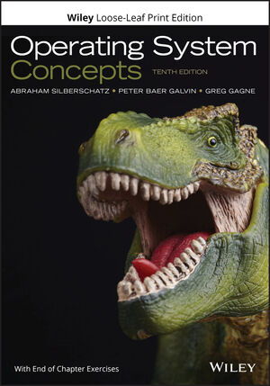

# CS Operation system

운영체제 공부 내용을 정리한 것을 모아 놓은 repository 입니다.

> 출처를 명백히 밝히며 영리행위가 목적이 아닌 개인 복습용으로 만든 저장소이며, 문제가 될 경우 삭제 조치 하도록 하겠습니다.

## 1. books

    

- Operating System Concepts 10th Edition

## 2. references

- [패스트캠퍼스-한 번에 끝내는 컴퓨터 공학 전공필수 & 인공지능 심화 초격차 패키지
  ](https://fastcampus.co.kr/dev_online_computer?gclid=CjwKCAjw-L-ZBhB4EiwA76YzOVYgofuuBK0m6-w4ajgUjcy9yLNw5uyAFlKnHANGpVAo-L8NEgcJ7hoCoOAQAvD_BwE)
