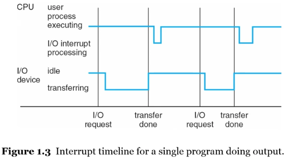

# 운영체제 기초

## TOC

1. [컴퓨터 시스템의 기본 구성 요소](#1-컴퓨터-시스템의-기본-구성-요소)
2. [운영체제의 정의와 역할](#2-운영체제의-정의와-역할)
3. [컴퓨터 시스템의 작동](#3-컴퓨터-시스템의-작동)
4. [인터럽트](#4-인터럽트)

## 1. 컴퓨터 시스템의 기본 구성 요소

    

- 하드웨어 (CPU, 메모리, 입출력장치)
- 운영체제
- 응용 프로그램
- 사용자 (사람, 기계, 컴퓨터)

## 2. 운영체제의 정의와 역할

운영체제의 목적은 다음과 같다.

- 유저 프로그램을 구동, 유저 문제 해결을 쉽게 하기
- 컴퓨터 시스템을 사용하기 쉽도록 하기
- 하드웨어를 효율적으로 사용할 수 있도록 하기

---

**운영체제의 정의 :**

커널과 시스템 프로그램으로 이루어져 있다.

| 커널                                     | 시스템 프로그램                                                 |
| ---------------------------------------- | --------------------------------------------------------------- |
| 컴퓨터에서 항상 실행되는 하나의 프로그램 | 모든 프로그램을 포함하고, 시스템 운영과 관련 있는 응용 프로그램 |

> 정의를 내리기 어렵다. 운영체제의 역할이 많다.

---

**운영체제의 역할 :**

- 리소스 할당

  - 모든 리소스를 관리한다.
  - 자원에 대한 충돌되는 요청 사이에서 효율적이고 공정하게 사용 리소스 분배

- 프로그램 제어

  - 프로그램 실행을 제어, 오류 및 부적절한 사용 방지

---

**컴퓨터 시스템 구조와 운영체제의 역할 :**

    

- 하나 이상의 CPU, 장치 컨트롤러는 공유된 메모리에 대한 접근을 제공하는 공용 버스를 통해 연결된다.
- 메모리를 두고 경쟁하는 CPU와 디바이스의 동시 실행

> 자원에 대해서 요청하는 여러 장치들을 조율해주는 역할을 운영체제가 수행한다.

## 3. 컴퓨터 시스템의 작동

**부트스트랩(bootstrap, 부팅) 과정 :**

- PC의 전원버튼을 누른 직후부터, 운영체제가 메모리에서 동작하기 시작할 때까지의 모든 과정

(1). 메인보드에 전력 공급

(2). ROM or EEPROM에 저장된 BIOS(펌웨어) 루틴이 시작

(3). BIOS는 셀프 테스트를 통해 주변 하드웨어를 체크

(4). MBR(Master Boot Record)에 존재하는 부팅정보를 읽어오는 부트스트랩 실행

- MBR은 디스크 내부에 존재

(5). RAM에 bootloader를 적재. 디스크에 있는 os(커널) 코드를 복사하여 메모리에 적재. 초기화

**컴퓨터 시스템 동작 전제 :**

> 컴퓨터 시스템이 동작하기 위한 몇가지 전제가 존재한다.

- 파트 2의 컴퓨터 시스템 구성도를 참고

- 입출력 장치, CPU는 동시 실행 가능
- 각 장치 컨트롤러는 특정 디바이스 유형을 담당한다. (로컬 버퍼 존재)
- CPU는 메인 메모리 - 로컬 버퍼간 데이터 이동
- 입출력은 장치에서 컨트롤러의 로컬 버퍼로 전달
- 장치 컨트롤러는 `인터럽트`를 발생시켜 CPU에 작업 완료를 알림

## 4. 인터럽트

**인터럽트 종류 :**

> CPU가 프로그램을 구동 중일 때, 입출력이나 예외 상황이 발생하여 처리가 필요한 경우 CPU에 신호를 보내는 것

- 하드웨어 인터럽트
  - 하드웨어가 발생시키는 인터럽트
  - CPU외의 하드웨어가 CPU에게 신호를 보내야 할 경우 발생
- 소프트웨어 인터럽트
  - 소프트웨어가 발생시키는 인터럽트
  - 사용자 프로그램이 인터럽트 하는 경우 발생. 예외 상황, supervisor call
  - 안전장치를 위해서 사용하기도 함

---

**인터럽트 발생시의 시스템 동작 :**

- 인터럽트 발생 => CPU가 수행중인 작업 중지, 지정된 위치로 실행 위치 변경
- 인터럽트 종료 => CPU는 일시 중단되었던 컴퓨팅 재개

  - 인터럽트는 서비스 루틴으로 제어 전송
  - 인터럽트에 의해 중단된 명령어 주소를 반드시 저장
  - 인터럽트 서비스 이후, 저장된 복귀 주소를 프로그램 카운터에 적재. 중단된 컴퓨팅 재개

---

**인터럽트 Timeline :**

    

---

**인터럽트 driven 입출력 사이클 :**

> 운영체제는 인터럽트 driven으로 동작한다.

    

