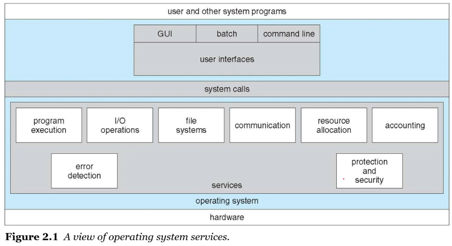

# 운영체제 구조

## TOC

1. [운영체제 서비스](#1-운영체제-서비스)
2. [운영체제 동작 - 시스템 콜](#2-운영체제-동작---시스템-콜)

---

## 1. 운영체제 서비스

> 운영체제는 사용자의 편의성을 위해 제공하는 기능들이 있다.

(1). 유저 인터페이스(User Interface)

- GUI(Graphical User Interface)
- CLI(Command Line Interface)
- 터치스크린

(2). 프로그램 실행

- 시스템은 반드시 메모리에 프로그램을 적재하고, 실행하고, 구동 종료까지 가능하게 하도록 한다.

(3). I/O 수행

- 실행 프로그램에 입출력이 필요할 경우 지원

(4). 파일시스템 조작

- 파일 및 디렉토리 읽기/쓰기/생성/삭제 지원. 사용자 권한 관리

(5). 통신

- 동일하거나 다른 컴퓨터 시스템의 프로세스 사이의 통신을 가능하게 함

---

> 편의성이 아닌 효율적인 시스템 운영을 위해 제공하는 기능들은 아래와 같다.

(1). 리소스 할당

- 다수개의 사용자 혹은 일을 동시에 처리할 때, 각각의 리소스에게 적당한 할당을 진행

(2). 로깅

- 어떤 프로그램이 얼마나 많은 / 어떤 종류의 컴퓨터 자원을 사용했는지 계속 추적

(3). 보호와 보안

- 다수 사용자나 네트워크 구성된 시스템이 동시 처리 시 서로 방해되지 않도록 함

## 2. 운영체제 동작 - 시스템 콜

**운영체제 서비스 View :**

    

- 운영체제에게 일을 요청하고 싶을 경우, 시스템 콜을 이용한다.
- `시스템 콜` : 커널 영역의 기능을 사용자 모드가 사용 가능하게 하는 하나의 수단
  - 프로세스가 하드웨어에 접근해서 필요한 기능을 사용할 수 있게 한다.
  - 응용프로그램에서 운영체제에게 어떠한 기능(시스템 자원)을 수행해달라고 하는 하나의 수단이다.

---

> 시스템 콜이 수행되어야 하는 이유는?

**듀얼 모드 :**

    

- 사용자와 운영체제는 시스템 자원을 공유한다.
- 사용자에게 제한을 두어 사용자가 메모리 내의 주요 운영체제 자원에 직접적으로 접근할 수 없도록 한다.(보안)
- 운영체제에서 프로그램이 구동되는 데 있어, 파일을 읽어오거나, 쓰거나 화면에 메시지를 출력하는 등 많은 부분이 커널모드를 사용한다.
- 커널모드와 유저모드를 분리한다.

---

> 예제를 통해 시스템 콜 이해하기

- `cp in.txt out.txt`를 입력했을 때 시스템 콜들

    

    

---

**시스템 콜 유형 :**

- 프로세스 제어

  - 프로세스 생성, 종료
  - 로드, 실행
  - 프로세스 속성 가져오기, 프로세스 속성 설정
  - Wait 이벤트, Signal 이벤트
  - 메모리 할당 및 해제

- 파일 관리

  - 파일 생성, 삭제
  - 열기, 닫기
  - 읽기, 쓰기, Reposition
  - 파일 속성 값 확인, 지정

- 장치 관리

  - 장치 요청, 해제
  - 읽기, 쓰기, 재배치
  - 장치 속성 가져오기, 설정
  - 논리적인 장치 연결 및 분리

- 정보 유지

  - 시스템 날짜 가져오기 및 설정
  - 시스템 데이터 가져오기 및 설정
  - 프로세스, 파일 및 장치 속성 가져오기 및 설정

- 통신
  - 통신 연결 생성, 삭제
  - 메시지 보내기, 받기
  - 전송상태 정보
  - 원경장치 연결 또는 분리
- 보호
  - 파일 권한 얻기 및 설정

---

**시스템 콜 과정 정리 :**

- 유저가 커널에게 시스템 콜 요청
- 커널은 시스템 콜 수행
- 시스템콜 결과를 유저에게 반환
