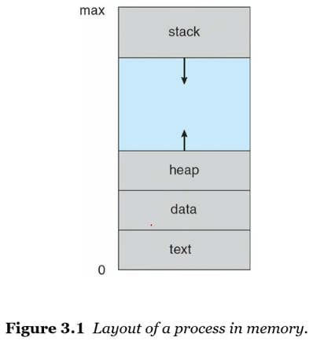
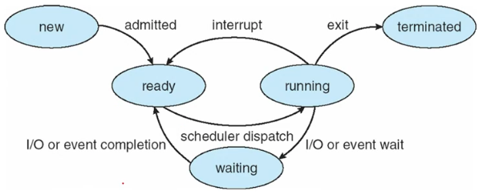
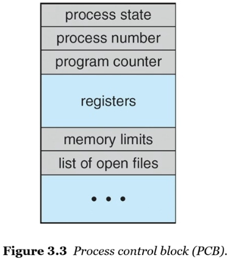
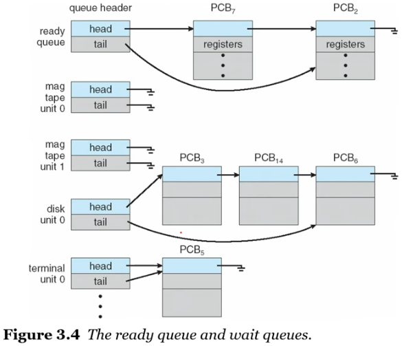
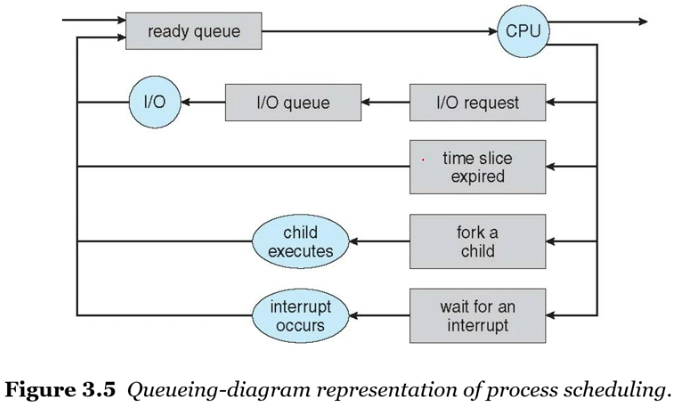
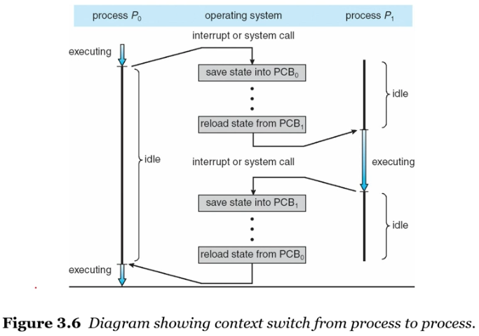

# 프로세스 관리

## 1. 프로세스 개념

**프로세스 정의 :**

- 실행중인 프로그램
- 디스크에 저장된 수동적 파일(실행 파일)이 메모리에 적재 될 때, 프로세스가 된다.
- JOB이라고도 한다.

---

**메모리 상에서의 프로세스 :**

> 프로세스는 메모리에서 특정 위치를 할당 받고, 내부적으로 자기 메모리를 동적으로 조정한다.

    

- `스택 세션`: 함수 호출 시 임시 데이터 저장

  - ex) 함수 매개 변수, 반환 주소, 지역 변수

- `힙 세션`: 프로그램 실행 시 동적으로 할당되는 메모리, 사용자가 관리 할 수 있는, 관리 해야 하는 영역

- `데이터 세션`: 전역 변수

- `텍스트 세션`: 실행 코드

---

**프로세스 상태 :**

> OS 별로 상이할 수 있다.

|                  |                                                                             |
| ---------------- | --------------------------------------------------------------------------- |
| 새로운(New)      | 프로세스가 생성 중                                                          |
| 실행(Running)    | 명령어들이 실행 중                                                          |
| 대기(Waiting)    | 프로세스가 어떤 사건(입출력 완료 또는 신호의 수신 같은)이 일어나기를 기다림 |
| 준비완료(Ready)  | 프로세스가 처리기에 할당 되기를 기다림                                      |
| 종료(Terminated) | 프로세스 실행이 종료                                                        |

    

---

**프로세스 제어 블록(PCB) :**

> 각 프로세스는 운영체제에서 프로세스 제어 블록(Process Control Block)에 의해 표현

    

- 프로세스 상태 : New, Ready, Running, Waiting, Halted 등

- 프로그램 카운터 : 프로세스가 다음에 실행할 명령어의 주소

- CPU 레지스터 : 누산기, 인덱스 레지스터, 스택 레지스터, 범용 레지스터, 상태 코드 정보 포함

  - > 인터럽트 이후 자기꺼 재실행할 때 이전 정보 저장해야하는데 이곳에 저장

- 메모리 관리 정보 : 기준 레지스터와 limit 레지스터의 값, 페이지 테이블, 세그먼트 테이블 등

- CPU 스케줄링 정보 : 프로세스 우선 순위, 스케줄링 큐에 대한 포인터와 다른 매개변수들을 포함

## 2. 프로세스 스케쥴링

> CPU 이용을 어떻게 최대화할 수 있을까?

- 쉬지 않고 일을 해야한다. 항상 어떤 프로세스가 실행될 수 있도록 한다.(다중 프로그래밍)

- 프로세스 스케쥴러는 CPU에서 실행 가능한 여러 프로세스들 중에서 하나의 프로세스를 선택

- 목적 : 대기시간 최소화, 최대한 공평하게, idle 최소화

---

**스케줄링 큐 :**

- 프로세스가 시스템에 들어오면 -> `Job Queue` (시스템 내부의 모든 프로세스)
- 준비 완료 상태에서 실행을 대기하는 프로세스들은 -> `Ready Queue`
  - 보통은 `Linked List`로 저장
- 특정 입출력 장치를 대기하는 프로세스들의 리스트 -> `Device Queue` (I/O 대기 큐)

    

---

**프로세스 스케쥴링을 표현하는 큐잉 도표 :**

    

먼저, ready queue에 있던 프로세스는 cpu를 획득하여 running 상태가 된다. 이때, 별 일 없이 프로세스가 마무리된 후 cpu를 빠져나가 terminate 될 수도 있다. 이제, 그렇지 않은 아래 경우를 보자.

- I/O request가 들어오면, 해당 프로세스는 I/O queue에서 waiting 상태가 된다. 이후 I/O가 마무리되면 다시 ready queue로 들어가서 대기한다.

- time slice expired는 특정 단위의 시간을 정하고, 해당 시간이 지나면 자동으로 expired 처리를 하여 running 중의 프로세스를 중지하는 것을 의미한다. 해당 성격의

- interrupt는 어떤 이벤트가 발생할 때 까지 기다리는 것은 아니기 때문에, wait queue가 아니라 곧바로 ready queue로 들어가는 것을 확인할 수 있다.

- fork a child는 running 중인 부모 프로세스가 자식 프로세스를 생성했을 때를 의미한다. 생성된 자식 프로세스는 new 상태를 거쳐 ready queue로 들어간다.
  어떤 interrupt가 발생할 때까지 wait queue에서 기다릴 수도 있다. 해당 interrupt가 발생하면, 이제 프로세스는 wait 상태에서 ready 상태로 바뀌게 된다.

> 프로세스가 종료되면 모든 큐에서 삭제되고, 자신의 PCB와 리소스들을 반환한다.

---

**장기/중기/단기 스케줄러 :**

> OS는 스케줄링을 하기 위해서 여러 큐에서 프로세스를 선택해야한다. 프로세스를 선택하기 위한 절차와 기준이 있어야 하는데 이 절차 자체를 스케줄러가 진행을 해준다. 스케줄러 자체도 다양한 스케줄러가 존재해서, 실제로 상황에 따라서 다양한 스케줄러가 적용된다. 내부적으로 진행된다.

- 보통은 시스템에서 당장에 처리할 수 있는 것보다 더 많은 프로세스 요청이 있다. 즉, 프로세스는 기다려야 한다.

- 단기 스케줄러

  - 레디된 프로세스 중에서 하나를 선택해서 CPU에 할당하는 역할을 한다.
  - CPU 스케줄러
  - 실행 빈도 높음

- 중기 스케줄러

  - 일부 운영체제가 도입
  - CPU를 얻으려고 적극적으로 경쟁하는 과열 프로세스들을 제거
  - 다중 프로그래밍 정도 완화
  - 프로세스 과열 감소
  - 메모리에서 프로세스들을 제거
  - 메모리 상의 프로세스들의 수를 완화
  - 스와핑(Swapping)
    - 진행하고 있던 프로세스들은 메모리에 다시 불러와서 중단되었던 지점에서 실행을 재개해주도록 함.

- 장기 스케줄러

  - 프로세스들을 선택해서 실행하기 위해서 메모리로 적재한다.
  - 잡 스케줄러
  - 실행 빈도 낮음
  - 메모리 상의 프로세스들의 수를 제어
  - 빈 구멍이 생기면 매워주는 역할로 생각
  - 장기는 실행빈도가 분단위이다. 장기는 메모리상의 프로세스의 갯수, 즉 멀티 프로그래밍의 정도를 제어한다.
  - 기법을 신중하게 선택해야 한다.
    - 입출력 중심 + CPU 중심 적절한 혼합 중요

## 3. 컨텍스트 스위치

- 인터럽트는 운영체제가 CPU를 현재 작업에서 빼앗아 커널 루틴을 실행할 수 있게 한다.
- 종료 후 본래 작업 중이던 프로세스를 재개한다.

> 하지만 재개하려면 어떤 값을 저장해야하는지, 어느 곳에 저장해야하는지, 이 작업을 어떻게 칭해야하는지 정해야한다.

- 어떤 값을 저장 => 실행 중이던 프로세스의 문맥(Context)
- 어느 곳에 저장 => PCB
- 이 작업을 어떻게 칭하는지 => 컨텍스트 스위치

---

**프로세스 간 컨텍스트 스위치 Flow :**

    

(1). 처음에는 0번 process가 cpu를 점유하여 executing 하고 있는 상태였다.

(2). 그런데 I/O interrupt인지 time expired인지 그런 원인에 의해 더이상 cpu를 점유할 수 없는 상태가 되었다.

(3). 그 즉시 0번 process의 정보를 담고 있는 0번 PCB에 상태가 저장 (save) 된다.

(4). 그리고 cpu에는 1번 process의 정보를 담고 있는 1번 PCB가 복원 (reload) 된다.

(5). 1번 process가 cpu를 점유했고, running 상태가 된다.

(6). 다시 2번과 같은 interrupt가 발생했고, 마찬가지로 1번 PCB에 정보가 저장된 후 0번 PCB가 다시 복원된다.

(7). 0번 process가 cpu를 점유하고 running 상태가 된다.

> 위 그림에서 컨텍스트 정보를 저장하고, 다른 프로세스로 교환하고 있는 상태를 컨텍스트 스위치라고 부른다.

---

**컨텍스트 스위치 더 알아보기 :**

- `문맥(Context)`

  - CPU 레지스터의 값, 프로세스 상태, 메모리 관리 정보 등을 포함한다.

- 컨텍스트 스위치가 진행될 동안의 시스템

  - 그 동안 시스템은 아무런 유용한 일을 하지 못한다. (정합성 위해서)
  - 컨텍스트 스위치 소요 시간은 순수한 오버헤드
