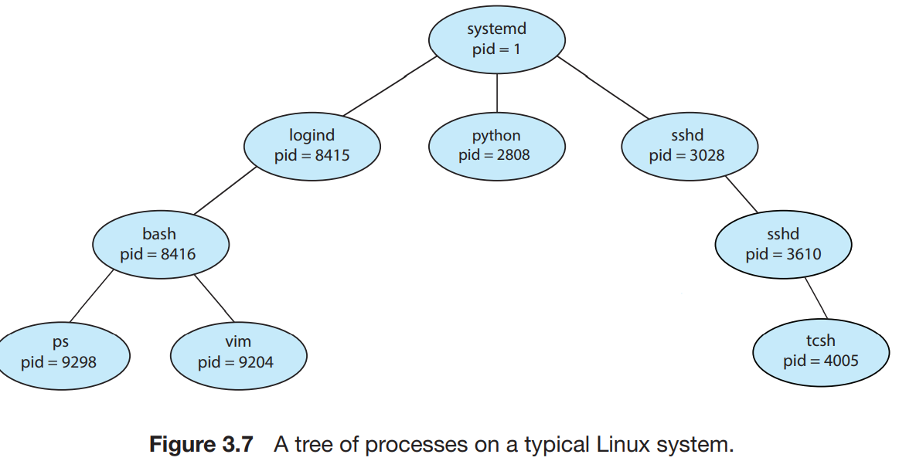
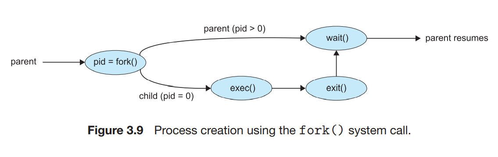
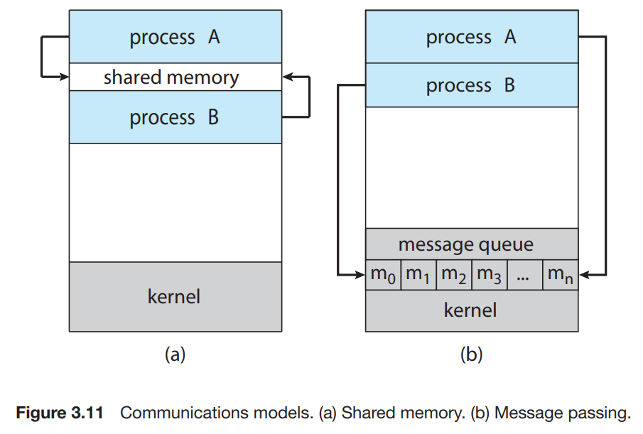
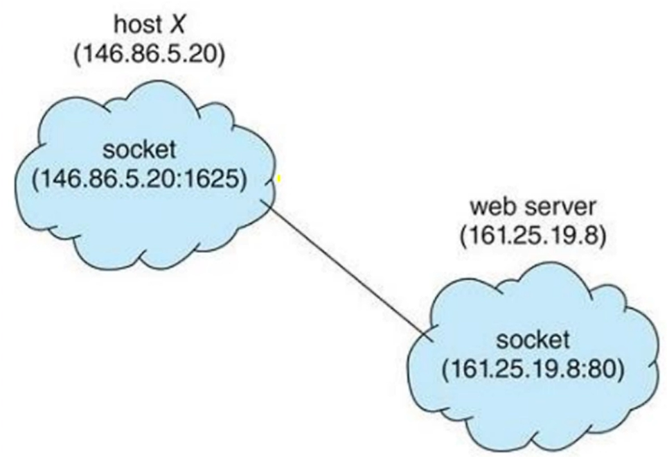
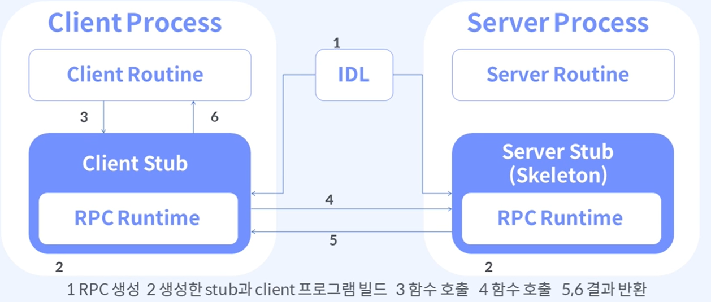

# 프로세스 관리

## TOC

1. [프로세스 개념](#1-프로세스-개념)
2. [프로세스 스케줄링](#2-프로세스-스케쥴링)
3. [컨텍스트 스위치](#3-컨텍스트-스위치)
4. [프로세스 연산(생성, 종료)](#4-프로세스-연산생성-종료)
5. [프로세스 간 통신](#5-프로세스-간-통신)
6. [클라이언트 서버 환경에서의 통신](#6-클라이언트-서버-환경에서의-통신)

---

## 1. 프로세스 개념

**프로세스 정의 :**

- 실행중인 프로그램
- 디스크에 저장된 수동적 파일(실행 파일)이 메모리에 적재 될 때, 프로세스가 된다.
- `JOB`이라고도 한다.

---

**메모리 상에서의 프로세스 :**

> 프로세스는 메모리에서 특정 위치를 할당 받고, 내부적으로 자기 메모리를 동적으로 조정한다.

<p align ="center">
    
</p>

- `스택 세션`: 함수 호출 시 임시 데이터 저장

  - ex) 함수 매개 변수, 반환 주소, 지역 변수

- `힙 세션`: 프로그램 실행 시 동적으로 할당되는 메모리, 사용자가 관리 할 수 있는, 관리 해야 하는 영역

- `데이터 세션`: 전역 변수

- `텍스트 세션`: 실행 코드

---

**프로세스 상태 :**

> OS 별로 상이할 수 있다.

|                  |                                                                             |
| ---------------- | --------------------------------------------------------------------------- |
| 새로운(New)      | 프로세스가 생성 중                                                          |
| 실행(Running)    | 명령어들이 실행 중                                                          |
| 대기(Waiting)    | 프로세스가 어떤 사건(입출력 완료 또는 신호의 수신 같은)이 일어나기를 기다림 |
| 준비완료(Ready)  | 프로세스가 처리기에 할당 되기를 기다림                                      |
| 종료(Terminated) | 프로세스 실행이 종료                                                        |

<p align ="center">
    
</p>

---

**프로세스 제어 블록(PCB) :**

> 각 프로세스는 운영체제에서 프로세스 제어 블록(Process Control Block)에 의해 표현

<p align ="center">
    
</p>

- 프로세스 상태 : New, Ready, Running, Waiting, Halted 등

- 프로그램 카운터 : 프로세스가 다음에 실행할 명령어의 주소

- CPU 레지스터 : 누산기, 인덱스 레지스터, 스택 레지스터, 범용 레지스터, 상태 코드 정보 포함

  - > 인터럽트 이후 자기꺼 재실행할 때 이전 정보 저장해야하는데 이곳에 저장

- 메모리 관리 정보 : 기준 레지스터와 limit 레지스터의 값, 페이지 테이블, 세그먼트 테이블 등

- CPU 스케줄링 정보 : 프로세스 우선 순위, 스케줄링 큐에 대한 포인터와 다른 매개변수들을 포함

## 2. 프로세스 스케쥴링

> CPU 이용을 어떻게 최대화할 수 있을까?

- 쉬지 않고 일을 해야한다. 항상 어떤 프로세스가 실행될 수 있도록 한다.(다중 프로그래밍)

- 프로세스 스케쥴러는 CPU에서 실행 가능한 여러 프로세스들 중에서 하나의 프로세스를 선택

- 목적 : 대기시간 최소화, 최대한 공평하게, idle 최소화

---

**스케줄링 큐 :**

- 프로세스가 시스템에 들어오면 -> `Job Queue` (시스템 내부의 모든 프로세스)
- 준비 완료 상태에서 실행을 대기하는 프로세스들은 -> `Ready Queue`
  - 보통은 `Linked List`로 저장
- 특정 입출력 장치를 대기하는 프로세스들의 리스트 -> `Device Queue` (I/O 대기 큐)

<p align ="center">
    
</p>

---

**프로세스 스케쥴링을 표현하는 큐잉 도표 :**

<p align ="center">
    
</p>

먼저, ready queue에 있던 프로세스는 cpu를 획득하여 running 상태가 된다. 이때, 별 일 없이 프로세스가 마무리된 후 cpu를 빠져나가 terminate 될 수도 있다. 이제, 그렇지 않은 아래 경우를 보자.

- I/O request가 들어오면, 해당 프로세스는 I/O queue에서 waiting 상태가 된다. 이후 I/O가 마무리되면 다시 ready queue로 들어가서 대기한다.

- time slice expired는 특정 단위의 시간을 정하고, 해당 시간이 지나면 자동으로 expired 처리를 하여 running 중의 프로세스를 중지하는 것을 의미한다. 해당 성격의

- interrupt는 어떤 이벤트가 발생할 때 까지 기다리는 것은 아니기 때문에, wait queue가 아니라 곧바로 ready queue로 들어가는 것을 확인할 수 있다.

- fork a child는 running 중인 부모 프로세스가 자식 프로세스를 생성했을 때를 의미한다. 생성된 자식 프로세스는 new 상태를 거쳐 ready queue로 들어간다.
  어떤 interrupt가 발생할 때까지 wait queue에서 기다릴 수도 있다. 해당 interrupt가 발생하면, 이제 프로세스는 wait 상태에서 ready 상태로 바뀌게 된다.

> 프로세스가 종료되면 모든 큐에서 삭제되고, 자신의 PCB와 리소스들을 반환한다.

---

**장기/중기/단기 스케줄러 :**

> OS는 스케줄링을 하기 위해서 여러 큐에서 프로세스를 선택해야한다. 프로세스를 선택하기 위한 절차와 기준이 있어야 하는데 이 절차 자체를 스케줄러가 진행을 해준다. 스케줄러 자체도 다양한 스케줄러가 존재해서, 실제로 상황에 따라서 다양한 스케줄러가 적용된다. 내부적으로 진행된다.

- 보통은 시스템에서 당장에 처리할 수 있는 것보다 더 많은 프로세스 요청이 있다. 즉, 프로세스는 기다려야 한다.

- 단기 스케줄러

  - 레디된 프로세스 중에서 하나를 선택해서 CPU에 할당하는 역할을 한다.
  - CPU 스케줄러
  - 실행 빈도 높음

- 중기 스케줄러

  - 일부 운영체제가 도입
  - CPU를 얻으려고 적극적으로 경쟁하는 과열 프로세스들을 제거
  - 다중 프로그래밍 정도 완화
  - 프로세스 과열 감소
  - 메모리에서 프로세스들을 제거
  - 메모리 상의 프로세스들의 수를 완화
  - 스와핑(Swapping)
    - 진행하고 있던 프로세스들은 메모리에 다시 불러와서 중단되었던 지점에서 실행을 재개해주도록 함.

- 장기 스케줄러

  - 프로세스들을 선택해서 실행하기 위해서 메모리로 적재한다.
  - 잡 스케줄러
  - 실행 빈도 낮음
  - 메모리 상의 프로세스들의 수를 제어
  - 빈 구멍이 생기면 매워주는 역할로 생각
  - 장기는 실행빈도가 분단위이다. 장기는 메모리상의 프로세스의 갯수, 즉 멀티 프로그래밍의 정도를 제어한다.
  - 기법을 신중하게 선택해야 한다.
    - 입출력 중심 + CPU 중심 적절한 혼합 중요

## 3. 컨텍스트 스위치

- 인터럽트는 운영체제가 CPU를 현재 작업에서 빼앗아 커널 루틴을 실행할 수 있게 한다.
- 종료 후 본래 작업 중이던 프로세스를 재개한다.

> 하지만 재개하려면 어떤 값을 저장해야하는지, 어느 곳에 저장해야하는지, 이 작업을 어떻게 칭해야하는지 정해야한다.

- 어떤 값을 저장 => 실행 중이던 프로세스의 문맥(Context)
- 어느 곳에 저장 => PCB
- 이 작업을 어떻게 칭하는지 => 컨텍스트 스위치

---

**프로세스 간 컨텍스트 스위치 Flow :**

<p align ="center">
    
</p>

(1). 처음에는 0번 process가 cpu를 점유하여 executing 하고 있는 상태였다.

(2). 그런데 I/O interrupt인지 time expired인지 그런 원인에 의해 더이상 cpu를 점유할 수 없는 상태가 되었다.

(3). 그 즉시 0번 process의 정보를 담고 있는 0번 PCB에 상태가 저장 (save) 된다.

(4). 그리고 cpu에는 1번 process의 정보를 담고 있는 1번 PCB가 복원 (reload) 된다.

(5). 1번 process가 cpu를 점유했고, running 상태가 된다.

(6). 다시 2번과 같은 interrupt가 발생했고, 마찬가지로 1번 PCB에 정보가 저장된 후 0번 PCB가 다시 복원된다.

(7). 0번 process가 cpu를 점유하고 running 상태가 된다.

> 위 그림에서 컨텍스트 정보를 저장하고, 다른 프로세스로 교환하고 있는 상태를 컨텍스트 스위치라고 부른다.

---

**컨텍스트 스위치 더 알아보기 :**

- `문맥(Context)`

  - CPU 레지스터의 값, 프로세스 상태, 메모리 관리 정보 등을 포함한다.

- 컨텍스트 스위치가 진행될 동안의 시스템

  - 그 동안 시스템은 아무런 유용한 일을 하지 못한다. (정합성 위해서)
  - 컨텍스트 스위치 소요 시간은 순수한 오버헤드

## 4. 프로세스 연산(생성, 종료)

**프로세스 생성 :**

- 실행되는 동안 프로세스는 여러 개의 새로운 프로세스들을 생성함

  - 프로세스를 생성하는 주체는 부모 프로세스, 새로운 프로세스는 자식 프로세스

- 대부분의 운영체제는 고유의 프로세스 식별자(pid)를 사용하여 프로세스를 구분

- 프로세스가 자식 프로세스를 생성할 때
  - 자식 프로세스는 운영체제에게 자원을 직접 얻을 수 있고,
  - 부모 프로세스가 가진 자원의 부분 집합만을 사용하도록 제한
- 프로세스가 새로운 프로세스를 생성힐 때
  - 부모 프로세스는 자식 프로세스와 동시에 구동
  - 부모 프로세스는 자식 프로세스 전부/일부가 종료될 때까지 대기

> 아래는 리눅스 운영체제의 전형적인 프로세스 트리이다.

<p align ="center">
    
</p>

- systemd는 init이라고도 하며, pid가 1로 고정이다.
- systemd는 시스템 부팅 시 실행한다.

---

**UNIX 예제를 통해 알아보는 fork(), exec()**

(1). fork() 시스템 콜로 새로운 프로세스 생성

(2). 두 프로세스 중 한 프로세스가 exec() 시스템 콜을 사용

- 자신의 메모리 공간을 새로운 프로그램으로 교체

(3). exec() 시스템 콜은 바이너리 파일을 메모리에 적재

- 프로그램 실행 시작

(4). 자식 프로세스가 종료될 때까지 부모 프로세스는 wait()

```c
#include <sys/types.h>
#include <stdio.h>
#include <unistd.h>

int main() {
  pid_t pid;

  pid = fork();
  if(pid < 0) {
    fprintf(stderr, "fork Failed");
    return 1;
  }

  // 자식 프로세스
  else if(pid == 0) {
    execlp("/bin/ls", "ls",NULL);
  } else { // 부모 프로세스는 자식 프로세스에서 생성된 0이상의 pid를 리턴
    wait(NULL);
    printf("Child Complete");
  }
  return 0;
}


```

- 자식 프로세스에게 보이는 pid는 0
- 부모 프로세스에게 보이는 pid 값은 0보다 큰 정수값(리턴값)
- 자식 프로세스는 리소스 권한, 스케쥴링 속성을 부모 프로세스로부터 상속
- 부모는 wait() 시스템콜로 자식 프로세스가 종료되기를 대기
- 자식 프로세스 종료 후 부모는 wait()으로부터 프로세스를 재개하여 exit()으로 종료

<p align ="center">
    
</p>

---

**프로세스 종료 :**

- 최종 실행이 종료된 뒤 exit()을 통해 운영체제에 삭제를 요청

  - 대기중인 부모 프로세스에게 상태 값을 리턴
  - 운영체제에 의해 모든 프로세스의 자원들은 할당 해제

- 부모 프로세스가 자식 프로세스를 종료 시키는 경우(abort())

  - 자식이 할당된 자원의 사용량을 초과하는 경우
  - 자식 task가 더 이상 필요하지 않는 경우
  - 부모가 종료되었고, 자식은 종료되지 않았을 때 자식만 실행될 순 없음 (cascading)

- `좀비 프로세스(zombie process)`

  - 종료되었지만 부모 프로세스가 아직 wait() 콜을 하지 않은 프로세스
  - 부모가 wait() 콜을 하면 좀비프로세스의 pid와 프로세스 테이블 항목이 운영체제에게 반환

  - 자식 프로세스가 부모 프로세스 보다 먼저 종료되는 경우에 발생

  - 자식 프로세스가 exit 시스템 콜을 호출 하면서 종료되면 이 프로세스에 관련된 모든 메모리와 리소스가 해제되어 다른 프로세스에서 사용할 수 있게 된다.

  - 자식 프로세스가 종료된 이후에 부모 프로세스가 자식 프로세스의 상태를 알고 싶을 수 있기 때문에 커널은 자식 프로세스가 종료되더라도 최소한의 정보(프로세스 ID, 프로세스 종료 상태 등)를 가지고 있게 된다.

  - 부모 프로세스가 좀비 프로세스의 종료상태를 회수하게 되면(wait 시스템콜을 호출을 통하여) 좀비 프로세스는 제거된다.

> 자식 프로세스에게 pid를 반환받는다. 프로세스가 종료되면 사용하던 리소스를 운영체제가 찾아가게 된다.

- `고아 프로세스(orphan process)`

  - 부모 프로세스가 wait()을 콜하는 대신 종료하게되면 자식은 고아 프로세스가 된다.
  - linux, UNIX 계열은 고아 프로세스의 새로운 부모 프로세스로 init 프로세스를 지정하여 문제를 해결
  - init은 주기적으로 wait()을 호출하게 된다.

> root 사용자가 부모 프로세스만 죽일 수 있다.

## 5. 프로세스 간 통신

**프로세스 간 통신의 개념 :**

- 프로세스들은 독립적이거나, 협력적
- 협력 프로세스는 데이터 공유를 포함하여, 프로세스들에게 영향을 주거나 받음
- 협력을 허용하는 환경을 제공하는 이유

  - `정보공유`, `계산 가속화(병렬 동시 처리)`, `모듈성`, `편의성`

- 프로세스 간 통신(Inter Process Communication, IPC) 기법을 필요로 함

---

**IPC의 두 가지 모델 :**

<p align ="center">
    
</p>

IPC에는 두가지의 기본적인 방법이 있는데, 1)shared memory 2)message passing 방식이 있다.

- shared memory 방식에서는, 프로세스간 공유할 메모리 공간이 만들어진다. 프로세스들은 이 공간에 데이터를 읽고 쓰는 것이다.

- message passing방식에서는, message교환을 통해 정보를 주고 받는다.

- 위의 두가지 방식은 많은 OS에서 흔히 사용되며, Message passing 방법은 프로세스 충돌이 없으므로 적은 양의 데이터를 교환할 때 효율적이다. 또한 shared memory보다 구현하기 쉽다.

- 반면에 shared memory 방식은 빠른데, message passing은 syscall에 의해 실행되어, kernel의 개입이 있어 시간이 더 많이 사용될 것이기 때문이다. shared memory방식에서는 공유 공간을 만들때만 syscall이 발생한다.

---

**공유 메모리 :**

> 원칙적으로 os는 한 프로세스가 다른 프로세스의 메모리 접근에 금지하고 있다.

- 공유 메모리는 두 프로세스가 위 제약조건을 제거하는 것을 전제로 한다.
- 통신하는 프로세스들이 공유 메모리 영역을 구축해야 한다. (프로세스가 진행)
- 동일한 위치에 write 하면 안된다. (충돌 방지 필요)
- `생산자 - 소비자 문제`

  - 생산자는 프로세스 정보를 생성한다.
  - 소비자는 정보를 소비한다.
  - 예를들어, 웹서버의 경우 html 파일이나 이미지를 생성하고, 제공한다.
  - 클라이언트인 웹 브라우저는 읽게 된다. (소비)
  - 일반적으로 생성하는 속도와 소비하는 속도가 다를 수 밖에 없다.
  - 즉, 생산자가 소비하는 것에 비해 많인 만들면 문제가 생김
  - 반대인 경우도 마찬가지

  => **해결책**: 공유 메모리 사용. 버퍼가 반드시 사용 가능해야한다.

- **버퍼**:
  - `무한 버퍼`: 버퍼의 크기에 실질적인 한계가 없음
  - `유한 버퍼`: 버퍼 크기 고정
    - 버퍼가 비어있으면 -> 소비자는 반드시 대기
    - 모든 버퍼가 채워져 있으면 -> 생산자가 대기

---

**생산자/소비자 프로세스 코드로 보기 :**

> in: 버퍼 내에서 다음으로 비어있는 위치 / out: 버퍼 내에서 첫 번째 차있는 위치

(1). 공유 메모리를 사용한 생산자 프로세스

```c
item next_produced;
while(true) {
  /*next_produced에 item 생산*/
  while(((in+1) % BUFFER_SIZE) == out);
  /*아무일도 안함*/

  buffer[in]=next_produced;
  in = (in + 1) % BUFFER_SIZE;

}
```

(2). 공유 메모리를 사용한 소비자 프로세스

```c
item next_consumed;
while(true) {

  while(in === out);
  /*아무일도 안함*/

  next_consumed = buffer[out];
  out = (out + 1) % BUFFER_SIZE;
  /*next_consumed에 있는 item 소비*/
}

```

---

**메시지 전달 :**

- 동일한주소 공간을 공유하지 않고도 프로세스들이 통신을 하고, 그 동작을 동기화할 수 있도록 허용하는 기법
- send(message) / receive(message) 연산 제공
- 네트워크로 인해서 연결, 분산시스템에서 유용
- 통신 연결(communication link)을 통해 프로세스 간 메시지를 송수신
- **논리적 구현 방법**
  - 직접,간접 통신
  - 동기식, 비동기식 통신
  - 자동, 명시적 버퍼링

---

**메시지 전달 - 직접 통신 :**

- 통신을 원하는 각 프로세스는 통신의 수신자 또는 송신자의 이름을 명시해야함

- 연결(link)이 자동적으로 생성
- 연결은 정확히 두 프로세스들 사이에만 연관
- 프로세스들의 각 상 사이에는, 정확히 한 연결만 존재

- `대칭 주소 지정`: 발신자, 수신자 프로세스 모두 이름 지정하여 통신
- `비대칭 주소 지정`: 발신자만 수신자의 프로세스 이름 지정

---

**메시지 전달 - 간접 통신 :**

- `메일함` 또는 포트로 메시지 송수신 (중간자가 있음)
- `메일함`을 추상적으로 보자면 프로세스가 메시지를 넣을 수 있는 공간, 제거될 수 있는 객체이다.
  - 메일함은 고유의 아이디가 있다.
- 두 프로세스는 프로세스가 공유된 경우에만 통신 가능
- 두 구성원이 모두 있는 경우에만 연결 설정(공유 메일함 존재)
- 연결은 두 개 이상의 프로세스와 연결 가능
- 프로세스의 각 쌍 상태에는 여러가지 서로 다른 연결이 존재
  - 꼭 내가 어디 연결되어 있다고 다른데에 연결 불가한 것이 아님!
- 공유 메일함: 프로세스 혹은 운영체제에게 소유권이 존재

> A 메일함을 공유하는 p1, p2, p3 중 p1이 A에 메시지를 보낸다면, 누가 메시지를 받아야 하는가?

=> 선택하는 기법에 따라서 좌우된다.

- 1. 최대 2개의 프로세스가 링크를 공유하도록 구성
- 2. 한번에 한 프로세스만 receive 연산을 수행할 수 있도록 함
- 3. 송신자가 수신자를 선택할 수 있도록 함

---

**메시지 전달 - 동기화 :**

- `Blocking 모드(동기, 봉쇄)`

  - Send: 송신된 메시지가 수신될 때까지 송신자를 블록(정지)
    - (혹은 큐에 메시지가 가득 차 있을 때 블록)
  - Receive: 이용 가능한 메시지가 있을 때까지 수신자를 블록(정지)

- `Non-Blocking 모드(비동기, 비봉쇄)`
  - Send: 메시지를 전달한 뒤 다른 작업을 처리
  - Receive: 유효한 메시지를 받거나 null메시지를 수신
    - 메시지를 받으면 해당 메시지가 유효한 내용인지 검사를 하고 처리를 한다.

---

**메시지 전달 - 버퍼링 :**

> 통신은 직접적이던, 간접적이던 프로세스 간 교환되는 메시지는 임시 대기열 (큐)에 존재

- 용량 Zero (최대 길이 0)
  - 발신자는 수신자가 메시지를 받을 때까지 차단
- 제한된 용량(유한 길이 n)
  - 연결이 가득 차면 발신자는 대기열 공간이 확보 될 때까지 차단
- 무한 용량
  - 발신자는 절대 차단하지 않음

---

**공유 메모리, 메시지 전달 비교 :**

> 메시지 전달은 충돌을 회피할 필요가 없어서 구현이 쉽다. 분산 시스템에서도 메시지 전달이 더 구현하기 쉽다.

> 메시지 전달은 시스템 콜을 하기 때문에 커널 간섭이나 부가적인 시간 소비 작업이 필요하기 때문에, 공유 메모리가 더 빠르다. (커널까지 안감)

> 멀티코어 시스템 상에서는 메시지 전달이 성능이 훨씬 더 낫다. 공유 메모리는 공유하는 데이터가 여러 캐시 사이에서, 특히 서버가 많은 경우에는 왔다갔다 해야하기 때문에 캐시 일관성을 지키는 과정을 하다가 성능이 떨어지는 문제가 발생한다.

|            | 공유메모리(좌) : 메시지 전달(우) |
| ---------- | -------------------------------- |
| 구현용이성 | <                                |
| 속도       | >                                |
| 분산환경   | <                                |

## 6. 클라이언트 서버 환경에서의 통신

**소켓 통신 :**

- 소켓(Socket)

  - 커뮤니케이션을 하기 위한 통신의 극점(Endpoint)
  - IP주소 및 Port 번호를 조합하여 식별

- 클라이언트-서버 아키텍쳐를 사용
  - 서버는 특정 포트를 listen하면서 클라이언트 요청에 대기
  - 요청을 받으면, 서버는 클라이언트 소켓으로부터의 연결 요청을 수락함으로써 연결이 완성

<p align ="center">
    
</p>

- 클라이언트는 랜덤 포트, 서버는 80 포트로 리슨

---

**원격 프로시저 호출(Remote Procedure Call, RPC)**

- 네트워크로 연결된 서버 상의 프로시저(함수, 메소드 등)을 원경으로 호출할 수 있는 기능

<p align ="center">
    
</p>

IDL: interface definition language

- IDL을 사용해서 서버의 호출 규약을 정의
- 함수명이라던지, 파라미터 들이 조정되는 IDL 파일을 RPC gen이라는 컴파일러를 통해 뼈대를 생성함 (양쪽에)
- 호출실행이나 반환시간이 보장되지 않고, 네트워크에 이상이 있을 때 알 수 없으며, 보안 측면에서도 걱정 거리가 있다.
