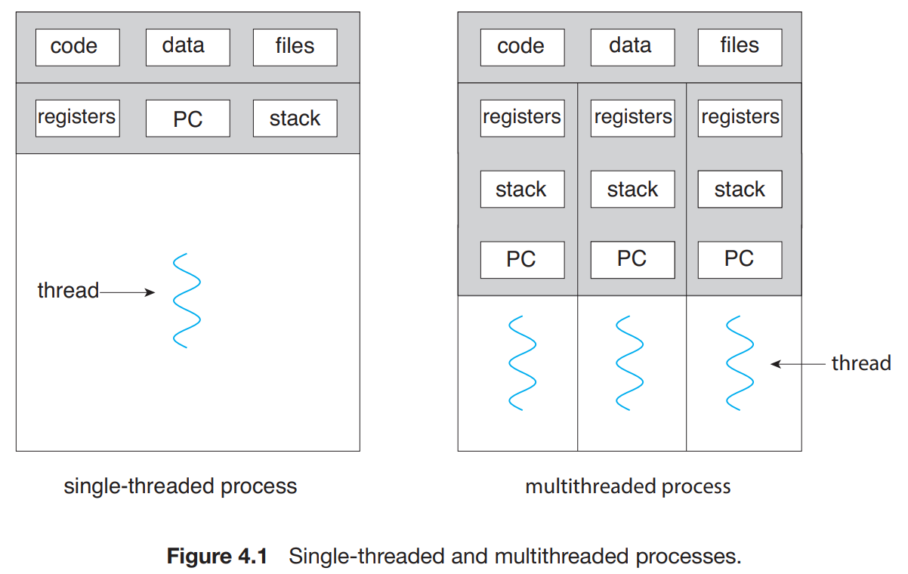
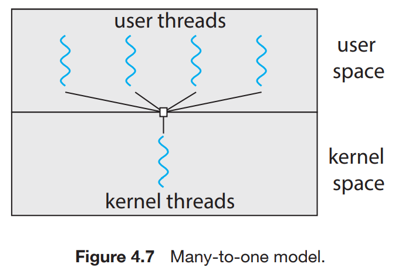
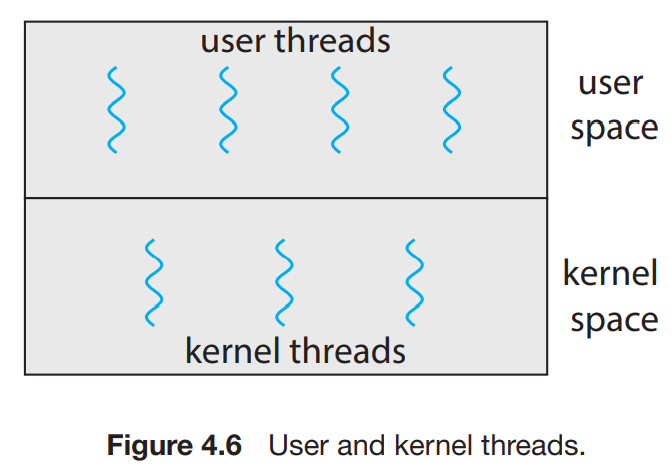
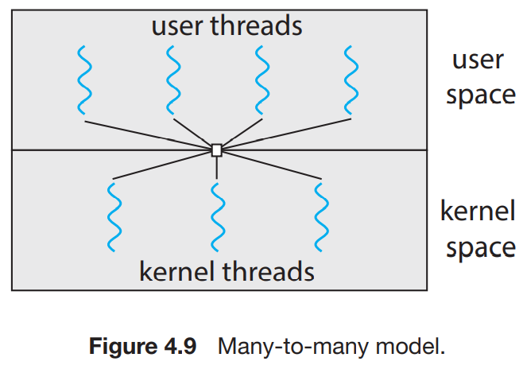
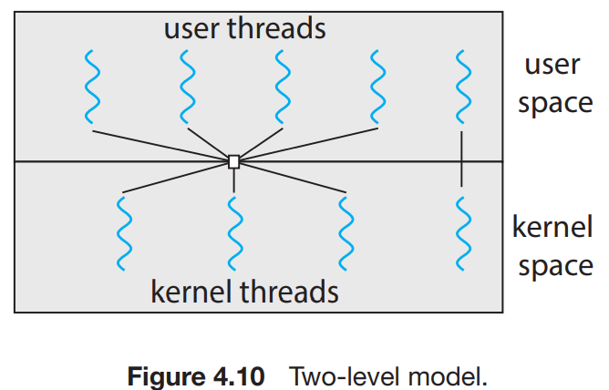

# 스레드와 동시성

## TOC

1. [단일 스레드와 멀티 스레드](#1-단일-스레드와-멀티-스레드)
2. [스레드 풀](#2-스레드-풀)

---

## 1. 단일 스레드와 멀티 스레드

    

**스레드 개념 :**

- `스레드(Thread)`
  - `CPU 활용의 기본 단위`
  - 프로세스 내에서 프로그램 명령을 실행하는 `기본 단위`
  - 스레드ID, 프로그램 카운터, 레지스터 집합, 스택으로 구성
  - 같은 프로세스에 속한 다른 스레드와 코드, 데이터 섹션, open files 등의 `운영체제 자원 공유`

---

**단일 스레드 :**

- 프로세스 내부(內) 제어 스레드 1개 -> 단일 스레드(single thread)

  - 1개의 레지스터, 1개의 스택
  - [장점]
    - 자원을 공용화 하지 않으므로 공용 자원 접근 통제
    - Context switch 작업 불필요
  - [단점]
    - 다수개의 CPU 활용이 불가

---

**멀티 스레드 :**

- 프로세스 내부(內) 제어 스레드 다수 -> 멀티 스레드(multi thread)
  - 프로그램을 다수의 실행 단위로 나누어 실행
  - 각각의 스레드가 고유의 레지스터와 스택으로 표현
  - [장점]
    - `대응적 측면` : 일부가 차단되거나 장시간 작업 수행시에도 계속해서 실행 가능
    - `자원 공유성` : 프로세스의 자원과 상태를 공유. 효율적인 운영
    - `경제성` : 자신이 속한 프로세스의 자원을 공유하기 때문에, 스레드를 만들고 context switch를 진행하는 것이 더 경제적
    - `확장성`: 다수개의 코어에서 병렬로 프로세스 실행

---

**유저 스레드와 커널 스레드 :**

|      | 유저 스레드                                                                                                                                                        | 커널 스레드                                                                                                                          |
| ---- | ------------------------------------------------------------------------------------------------------------------------------------------------------------------ | ------------------------------------------------------------------------------------------------------------------------------------ |
| 특징 | - `커널의 별도 지원 없이 커널 위에서 동작`  - 스레드 라이브러리에 스레드 생성/파괴를 위한, 메시지/데이터 전달을 위한, 스레드 문맥 저장/복구를 위한 코드가 포함 | - `운영체제로부터 직접 지원과 관리를 받음 `                                                                                          |
| 장점 | - 스레드 스위칭에서 커널모드 권한이 필요하지 않음   - 어느 운영체제에서나 사용 가능   - 빠르게 생성 및 관리 가능                                           | - 동일한 프로세스의 여러 스레드를 서로 다른 프로세스에 예약 가능   - 프로세스의 한 스레드가 차단되면 커널은 다른 스레드를 예약함 |
| 단점 | - 한 유저 스레드가 차단 수행시 전체 프로세스가 차단됨   - 멀티프로세싱의 이점을 가질 수 없음                                                                   | - 커널 모드로의 전환은 프로세스에서 한 스레드에서 다른 스레드로 제어 전환이 필요   - 유저 스레드에 비해 수백배 느림              |

---

**멀티 스레딩 모델 - 다대일 모델 :**

    

- 다수의 유저 스레드가 하나의 커널 스레드와 맵핑
- 한 번에 하나의 스레드만 커널에 액세스 할 수 있으므로 멀티 스레드는 멀티코어 시스템에서 병렬로 실행할 수 없다.

---

**멀티 스레딩 모델 - 일대일 모델 :**

    

- 각각의 유저 스레드를 커널 스레드와 맵핑
- 더 많은 병렬성, 그러나 사용자 수준 스레드 생성시에도 커널 스레드 생성이 필요하다는 단점이 있다.

---

**멀티 스레딩 모델 - 다대다 모델 :**

> 일대일 모델은 유저 수준에서 처리 가능한 일에도 커널 스레드를 만들어야 하는 비효율성이 있다.

    

- 많은 유저 레벨 스레드를 더 작거나 같은 수의 스레드로 다중화
- 커널 스레드 수는 응용 프로그램이나 특정 기계로부터 특정되어짐
- 개발자는 필요한 만큼 많은 유저 스레드 생성 가능
- 스레드가 봉쇄형 시스템 호출발생시에도 커널은 다른 스레드 수행을 스케쥴 할 수 있음

---

**멀티 스레딩 모델 - 2단계 모델 :**

    

- 많은 유저 레벨 스레드를 더 작거나 같은 수의 스레드로 다중화
- 또한 한 유저 스레드가 하나의 커널 스레드에만 맵핑되는 것을 허용
- 다대다와 일대일을 합쳐 놓은 형태
- 일대일이 효율적인 경우가 있기 때문에 혼합형으로 나옴

## 2. 스레드 풀

> 암묵적 스레딩이란 스레딩의 생성, 관리에 대한 책임을 개발자가 하는게 아니라, 컴파일러나 실행 시간 라이브러리 쪽에 넘겨주는 것

**스레드 풀 :**

    

> 서비스 할때마다, 매 요청 마다 스레드를 만드는 것은 시간이 많이 걸린다.

- `스레드 풀(Thread Pool)`

  - 지정된 개수의 스레드를 미리 생성해두고 필요시 꺼내어 쓰는 방식
  - 요청이 폭증해도 성능을 유지
  - 대량 작업 처리에서 반드시 고려 필요

- 장점

  - 급격한 성능저하 방지
  - 동시 사용자수 증가시에도 대응 가능
  - 이전 생성 스레드 재사용 가능(시스템 자원 측면에서 장점)

- 단점
  - 과다 생성시 메모리 측면에서 낭비 발생 가능성
