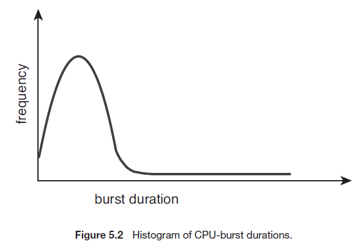

# CPU 스케줄링

## TOC

1. [CPU 스케쥴링 기본 개념 ](#1-cpu-스케쥴링-기본-개념)
2. [스케쥴링 알고리즘](#2-스케쥴링-알고리즘)
3. [스케쥴링 알고리즘 선택 기준](#3-스케쥴링-알고리즘-선택-기준)

---

## 1. CPU 스케쥴링 기본 개념

- 멀티프로그래밍 환경에서 일을 쉬지않고 계속 시키는 것이 OS의 숙제(maximize CPU utilization)

> 프로세스 실행은 cpu 실행이나 i/o로 이루어져 있다.

- CPU - I/O 버스트(Burst) Cycle

  - 프로세스 실행은 CPU 실행 및 입출력(I/O) 대기로 구성

- CPU 버스트 분포
  - 많은 수의 짧은 CPU 버스트와 적은 수의 긴 CPU 버스트
    - I/O-bound 프로그램 -> 많은 수의 짧은 CPU 버스트
    - CPU-bound 프로그램 -> 적은 수의 긴 CPU 버스트

**CPU와 입출력 버스트의 교차 :**

<p align ="center">
    
</p>

---

**CPU 버스트 시간의 도표 :**

<p align ="center">
    
</p>

- 지속시간(burst duration)이 적을 수록 빈도수 많다.

  - I/O-bound 프로그램

- 지속시간이 길수록 빈도수가 적다.
  - CPU-bound 프로그램

---

**CPU 스케쥴러 :**

- CPU 스케쥴러

  - 메모리에 있는 프로세스들 중 실행할 준비가 되어있는 ready 상태의 프로세스를 선택하고, 그 프로세스에 CPU를 할당한다.

  - 단기 스케쥴러가 이 일을 수행한다.

- CPU 스케쥴링 결정은 다음의 네 가지 상황에서 발생

  - 1. 한 프로세스가 실행 상태에서 대기 상태로 전환 될 때
  - 2. 프로세스가 실행 상태에서 준비 완료 상태로 전환될 때
  - 3. 프로세스가 대기 상태에서 준비 완료 상태로 전환될 떄
  - 4. 프로세스가 종료될 때

> 대기열에 줄 서있는 요소들은 PCB이다.

- 1번이나 4번은 비선점형, 협조적 스케쥴링
- 2번 3번은 선점형
- 선점형 스케줄링은 정합성 이슈가 생길 수 있다.

---

**Non-preemptive scheduling :**

- CPU가 프로세스에 할당되면, 프로세스는 CPU를 실행이 종료되거나 ready waiting 상태가 되기 전까지 계속된다.

- OS가 프로세스를 중간에 뺏는것이 불가하다.

장점: 적은 Context-swtich 부담
단점: longer response time

---

**Preemptive Scheduling :**
CPU에서 작동되는 프로세스를 중단시킬 수 있으며, ready state로 보내질 수 있다. Real-time OS에 적합.

장점: 낮은 response time, 효율적이다
단점: 많은 Context-switching overhead, race conditions(실행되는 순서에 의해 결과가 달라짐)

---

**디스패쳐 :**

> Dispatcher는 CPU 스케쥴러에 의해 선택된 프로세스를 CPU에 부착하는 역할을 한다.

- CPU 스케쥴링 기능에 포함된 요소이며 CPU 제어를 단기 스케쥴러가 선택한 프로세스에게 전달해주는 모듈

- 디스패쳐 작업

  - context switch
  - 사용자 모드로 전환
  - 프로그램을 다시 시작하기 위해 사용자 프로그램의 적절한 위치로 이동
  - 모든 context switch에서 호출이 되기 떄문에 최대한 빨리 수행이 돼야한다.

- 디스채피 지연(Latency)
  - 하나의 프로세스를 중지하고 다른 프로세스를 실행시킬 때 소요되는 시간

<p align ="center">
    
</p>

---

**스케쥴링 기준 :**

- CPU 이용률(CPU utilization) : CPU를 가능한 최대한 바쁘게 유지

  - CPU를 얼마나 많이 사용할 수 있는가?

- 처리량(Throughput) : 단위 시간 당 완료된 프로세스의 개수

  - 더 많이 처리할 수 있으면 좋다.

- 총 처리 시간(Turnaround time) : 프로세스의 제출 시간과 완료 시간의 간격

  - 시간이 낮을수록 효율적이다.

- 대기 시간(Waiting time) : 준비 완료 큐에서 대기하면서 보낸 시간의 합

  - 시간이 낮을수록 효율적이다.

- 응답 시간(Response time): 하나의 요구를 제출한 후 첫 번째 응답이 발생할 때까지의 시간(응답 출력하는데 걸리는 시간x)

  - 시간이 낮을수록 효율적이다.

## 2. 스케쥴링 알고리즘

> 4가지 알고리즘을 공부하며 장점, 단점, 특징을 다룬다.

- 선입 선처리 스케줄링 (First-come, First-Served, FCFS)

  - CPU를 먼저 요청하는 프로세스가 CPU를 먼저 할당 받음
  - FIFO 큐로 관리

- 최단 작업 우선 스케줄링(Shortest-Job-First, SJF)

  - CPU burst가 짧을 수록 CPU를 먼저 할당 받음

- 우선 순위 스케쥴링(Priority)

  - 우선순위가 프로세스들에 연관되어 있으며, 높은 우선순위를 가진 프로세스에게 CPU 할당

- 라운드 로빈 스케쥴링(Round-Robin)
  - 시간 할당량이라고 일컫는 작은 단위의 시간을 정의
  - 한 번에 한 프로세스에게 한 번의 시간 할당량동안 CPU를 할당

---

**선입 선처리 스케쥴링 :**

> 가장 먼저 들어온 것이 가장 먼저 처리된다.

| Process | Burst Time |
| ------- | ---------- |
| P1      | 24         |
| P2      | 3          |
| P3      | 3          |

```
P1 | P2 | P3 |
   24   27   30
```

- 대기 시간

  - P1 = 0
  - P2 = 24
  - P3 = 27
  - 평균 대기 시간 = 17

- 총 처리 시간
  - P1 = 24
  - P2 = 27
  - P3 = 30
  - 평균 총 처리 시간 = 27

---

> P2, P3, P1으로 순서가 바뀐다면?

| Process | Burst Time |
| ------- | ---------- |
| P2      | 3          |
| P3      | 3          |
| P1      | 24         |

```
P2 | P3 | P1 |
   3    6    30
```

- 대기 시간

  - P2 = 0
  - P3 = 3
  - P1 = 6
  - 평균 대기 시간 = 3

- 총 처리 시간

  - P2 = 3
  - P3 = 6
  - P1 = 30

  - 평균 총 처리 시간 = 13

> 순서에 따라서 성능의 차이가 달라진다.

---

**최단 작업 우선 스케쥴링 :**

> CPU burst가 짧을 수록 CPU를 먼저 할당 받음

| Process | Burst Time |
| ------- | ---------- |
| P1      | 6          |
| P2      | 8          |
| P3      | 7          |
| P4      | 3          |

P4 -> P1 -> P3 -> P2 순으로 할당된다.

```
P4 | P1 | P3 | P2 |
   3    9    16   24
```

- 평균 대기 시간 = (0 + 3 + 9 + 16) / 4 = 7

> 평균 대기 시간을 최소화하는 알고리즘이라 평가할 수 있지만, CPU 요청을 매번 처음부터 끝까지 알기 힘들다. 예를들어 P5,P6... 계속 들어오는 것을 예측 불가능함

---

**우선순위 스케쥴링 :**

> 우선순위가 프로세스들에 연관되어 있으며, 높은 우선순위를 가진 프로세스에게 CPU 할당

| Process | Burst Time | Priority |
| ------- | ---------- | -------- |
| P1      | 10         | 3        |
| P2      | 1          | 1        |
| P3      | 2          | 4        |
| P4      | 1          | 5        |
| P5      | 5          | 2        |

P2 -> P5 -> P1 -> P3 -> P4 순서로 할당된다.

```
P2 | P5 | P1 | P3 | P4 |
   1    6    16   18   19
```

- 평균 대기 시간 = (0 + 1 + 6 + 16 + 18)/5 = 8.2

> 효율적이기 보단, 내부적 요인이나 외부적 요인에 의해서 우선순위를 부여하게된 순서에 따라서 프로세스를 진행할 수 있다는 것이 장점이다. 하지만, 새로운 프로세스가 들어올때마다 우선순위가 계속 밀려 수행되지 않고 대기하는 상황이 발생할 수도 있다.

---

**라운드 로빈 스케쥴링 :**

> 시간 할당량(Time Quantum)이라고 일컫는 작은 단위의 시간을 정의한다.
> 한 번에 한 프로세스에게 한 번의 시간 할당량동안 CPU를 할당

| Process | Burst Time |
| ------- | ---------- |
| P1      | 24         |
| P2      | 3          |
| P3      | 3          |

Time Quantum = 4 라고 가정

```
 P1| P2 | P3 | P1 | P1 | P1 | P1 | P1 |
   4    7    10   14   18   22   26   30
```

- 평균 대기 시간 = (6 + 4 + 7) / 3 = 5.6
- 평균 총 처리 시간 = 30 + 7 + 10 / 3 = 15.6667

Time Quantum = 20 이라고 가정

| Process | Burst Time |
| ------- | ---------- |
| P1      | 53         |
| P2      | 17         |
| P3      | 68         |
| P4      | 24         |

```
 P1 | P2 | P3 | P4 | P1 | P3 | P4 | P1 | P3 | P3 |
    20   37   57   77   97   117  121  134  154  162
```

## 3. 스케쥴링 알고리즘 선택 기준

**선입 선처리 스케쥴링 :**

> 1. CPU를 먼저 요청하는 프로세스가 CPU를 먼저 할당 받음
> 2. FIFO 큐로 관리

- 장점 :
  - 가장 간단한 형태
  - 코드 작성이 쉽고 이해하기 쉬움
- 단점 :
  - 순서에 따라 대기 시간의 차이가 큼
  - 모든 다른 프로세스들이 하나의 긴 프로세스가 CPU를 양도하기를 기다려야 함(호위효과, Convoy effect)
  - 비선점형이기 때문에, 시분할에 부적합

---

**최단 작업 우선 스케쥴링 :**

> 1. CPU burst가 짧을 수록 CPU를 먼저 할당 받음

- 장점 :

  - 최소의 평균 대기시간

- 단점 :
  - 다음 CPU 요청의 길이 파악이 어려움(예측 어려움)

> 선점형, 비선점형에따라 알고리즘 방식이 다르다.

---

**선점형 최단 작업 우선 스케쥴링/최소 잔여 시간 우선 스케쥴링 :**

| Process | Arrival Time | Burst Time |
| ------- | ------------ | ---------- |
| P1      | 0            | 8          |
| P2      | 1            | 4          |
| P3      | 2            | 9          |
| P4      | 3            | 5          |

```
P1 | P2 | P4 | P1 | P3 |
   1    5    10   17   26
```

- 평균 대기 시간 = [(10-1) + (1-1) + (17 -2) + 5 -3] / 4 = 6.5

- Arrival Time은 도착 시간

---

**비선점형 최단 작업 우선 스케쥴링 :**

| Process | Arrival Time | Burst Time |
| ------- | ------------ | ---------- |
| P1      | 0            | 7          |
| P2      | 1            | 4          |
| P3      | 4            | 1          |
| P4      | 5            | 4          |

```
P1 | P3 | P2 | P4 |
   7    8    12   16
```

- 평균 대기 시간 = (0 + 6 + 3 + 7)/4 = 4

---

**평가-우선 순위 스케쥴링 :**

> 1. 우선순위가 프로세스들에 연관되어 있으며, 높은 우선순위를 가진 프로세스에게 CPU 할당

- 장점 :

  - 내부적 정의(시간제한, 메모리 요구, open files 수 등) 활용 가능
  - 외부적 정의(프로세스의 중요성, 컴퓨터 사용을 위해 지불되는 비용의 유형과 양 등) 활용 가능

- 단점 :
  - 무한 봉쇄, 기아 상태 -> Aging 고려

> 프로세스가 처리될 떄마다 대기열에 남아있는 프로세스의 우선순위를 일정시간이 지나면 올려주는 방식으로 기아 상태 해결 가능 (Aging)

---

**라운드 로빈 스케쥴링 :**

> 1.  시간 할당량이라고 일컫는 작은 단위의 시간을 정의
> 2.  한 번에 한 프로세스에게 한 번의 시간 할당량 동안 CPU를 할당

- 장점 :
  - 시분할 시스템 최적화
- 단점 :
  - 시간 할당량(Time Quantum)에 따른 영향도 존재
    - 너무 클 경우 : FCFS와 동일한 알고리즘이 됨
    - 너무 작을 경우 : Context Switch에 시간을 더 뺏김

---

**라운드 로빈 스케쥴링 - 시간 할당량 별 평균 총 처리 시간 예시 :**

<p align ="center">
    
</p>

- 경향성을 가지지않음, 평가가 어렵다.
- CPU burst의 한 80프로정도까지는 time quantum보다 짧아야한다.

---

**다단계 큐 스케쥴링 :**

- 프로세스 타입에 따라 몇 개의 큐로 나누어 프로세스를 분류

  - 포그라운드(대화형), 백그라운드(일괄처리)

- 큐 별로 별도의 스케쥴링 알고리즘을 가짐

  - 포그라운드 - RR / 백그라운드 - FCFS

- 각 큐는 낮은 우선순위의 큐보다 절대적인 우선순위를 가짐

- 각 큐는 일정 비율로 CPU 시간을 나누어 사용
  - 포그라운드 큐 - RR, CPU 시간의 80%
  - 백그라운드 큐 - FCFS, CPU 시간의 20%

<p align ="center">
    
</p>

- 1번, 2번,3번 큐가 안비면 4번은 절대 실행이 안된다.
- 이렇게 하지 않는다면, 다른 방법으로 큐들 사이에 시간을 나누어 사용하도록 설정 가능하다.

> 프로세스가 영구적으로 하나의 큐에 할당 되기 떄문에 융통성이 없어질 수 있다. 이것을 극복하기 위해 다단계 피드백 큐 스케쥴링이 등장했다.

---

**다단계 피드백 큐 스케쥴링의 개념 :**

- 프로세스가 큐들 사이를 이동하는 것을 허용
- 프로세스를 CPU 버스트 성격에 따라 구분
- Aging을 통해 기아 상태 예방

- 다단계 피드백 큐 스케쥴러는 다음의 파라미터에 의해 정의된다.
  - 큐의 개수
  - 각 큐를 위한 스케쥴링 알고리즘
  - 한 프로세스를 높은 우선순위 큐로 올려주는 시기를 결정하는 방법
  - 한 프로세스를 낮은 우선순위 큐로 강등시키는 시기를 결정하는 방법
  - 프로세스가 서비스를 필요로 할 때 프로세스가 들어갈 큐를 결정하는 방법

> 가장 일반적인 알고리즘이다.

---

**다단계 피드백 큐 스케쥴링 예시 :**

<p align ="center">
    
</p>

- Q0: 시간할당량 8ms, RR
- Q1: 시간할당량 16ms, RR
- Q2: FCFS
- 스케쥴링 시나리오 :
  - 새로운 job이 Q0으로 진입, 시간할당량 8ms 내에 종료되지 않을 경우 Q1으로 이동
  - Q1으로 진입한 프로세스가 시간할당량 16ms 내에 종료되지 않을 경우 Q2로 이동
