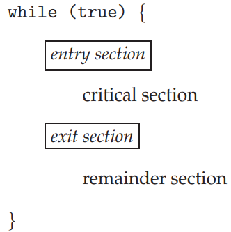
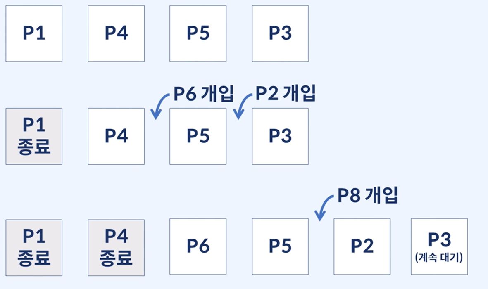

# 프로세스 동기화

## TOC

1. [임계구역 문제와 그 해결안](#1-임계구역-문제와-그-해결안)
2. [뮤텍스와 세마포어](#2-뮤텍스와-세마포어)
3. [교착상태(Deadlock)와 기아상태(Starvation)](#3-교착상태deadlock와-기아상태starvation)
4. [전통적인 프로세스 동기화 문제](#4-전통적인-프로세스-동기화-문제)

---

## 1. 임계구역 문제와 그 해결안

**전제 :**

- 데이터 정합성 이슈의 발생
  - 동시에 공유 데이터에 접근한다면 데이터 불일치가 발생할 수 있음
  - 데이터 일관성을 유지할려면 협력 프로세스간의 순차적인 실행을 보장하는 매커니즘이 필요

---

**Count 값을 조정하기 - 다시 돌아온 생상자/소비자 문제 :**

- 버퍼에서 항목을 추가할때마다, 카운트값을 증가.
- 항목을 꺼낼때마다, 카운트값을 감소하는 매커니즘이 있다고 가정

> 생산자/소비자 문제를 공유메모리,버퍼를 통해서 해결했던 것을 떠올려보자.

(1). 공유 메모리를 사용한 생산자 프로세스(생산될 때마다 count 증가)

```c
item next_produced;
while(true) {
  /*next_produced에 item 생산*/
  while(count==BUFFER_SIZE));
  /*아무일도 안함*/

  buffer[in]=next_produced;
  in = (in + 1) % BUFFER_SIZE;
  count++
}
```

(2). 공유 메모리를 사용한 소비자 프로세스 (소비될 때마다 count 감소)

```c
item next_consumed;
while(true) {

  while(count==0);
  /*아무일도 안함*/

  next_consumed = buffer[out];
  out = (out + 1) % BUFFER_SIZE;
  count--;
  /*next_consumed에 있는 item 소비*/
}

```

> 두개의 프로세스는 하나의 변수 count를 동시에 조작하도록 허용하기 때문에, 정합성에 문제가 생길 수 있다.

예를 들면,

- count 초기값을 5로 가정

- count++를 풀어서 표현하면
  - register1 = count
  - register1 = register1 + 1
  - count = register1
- count--를 풀어서 표현하면

  - register2 = count
  - register2 = register - 1
  - count = register2

- count=5라고 표현되기까지의 과정(항상 아래처럼 실행되지 않는다.)
  - T0 : 생산자가 register1 = count 수행 {register1 = 5}
  - T1 : 생산자가 register1 = register1 + 1 수행 {register1 = 6}
  - T2 : 소비자가 register2 = count 수행 {register = 5}
  - T3 : 소비자가 register2 = register2 - 1 수행 {register2 = 4}
  - T4 : 생산자가 count = register1 수행 {count=6}
  - T5 : 소비자가 count = register2 수행 {count=4}

> T4,T5의 순서가 바뀌거나, 지금 조차도 데이터 정합성 문제가 생긴다. 여러 프로세스가 동시에 동일한 데이터에 접근해서 조작하고, 그 결과가 언제, 먼저 접근하냐에따라 값이 달라지는 상황을 경쟁상황이라고 한다.

우리는 경쟁상황을 방지하기 위해서, 한 순간에 한 프로세스만 count를 조작할 수 있도록 보장해야한다. 프로세스 동기화를 위해서 이런 전제가 필요하다.

---

> 프로세스 동기화에 대한 논의는 임계구역 문제로부터 시작한다.

**임계구역(Critical-Section) 문제 :**

- 각 프로세스에는 임계 구역이라고 하는 코드 세그먼트가 존재
  - 프로세스가 액세스하고, 업데이트하는 데이터, 적어도 하나의 다른 프로세스와 공유됨
- 하나의 프로세스가 임계 구역에서 실행 중 일때, 다른 프로세스들은 해당 임계 구역에 접근할 수 없음
- 일반적으로 프로세스는 진입구역/퇴출구역,나머지구역으로 구성

- 프로세스들이 협력할 때 사용할 수 있는 프로토콜을 설정하는 것이다.
  - 각 프로세스가 자신의 임계구역에 진입하려면 진입 허가가 있어야한다. -> 진입 구역

<p align="center">
    
</p>

> 임계구역 문제(critical-section problem)는 프로세스가 협업적으로 자료를 공유할 수 있도록 자신의 활동을 동기화하기 위한 프로토콜을 설계하기 위함임.

---

**임계구역 문제 해결을 위한 요구조건 :**

- 상호 배제(Mutual Exclusion)

  - 프로세스 Pᵢ가 임계구역에서 실행될 때, 다른 어떤 프로세스도 임계 구역에 접근할 수 없음

- 진행(Progress)

  - 임계구역에서 실행중인 프로세스가 없고, 임계구역에 들어가고자 하는 프로세스가 존재한다면, 나머지 구역에서 실행중이지 않은 프로세스들만 다음 임계구역에 진입할 프로세스를 결정하는 데 참여 할 수 있음.
  - 이 선택은 무한정 연기할 수 없음

- 제한이 있는 대기시간(Bounded Waiting)
  - 프로세스가 자신의 임계구역에 진입하려는 요청을 한 후부터, 그 요청이 허용될 때까지 다른 프로세스들이 자신들의 임계구역에 진입하도록 허용하는 횟수에 한계가 있어야 한다.

---

**피터슨의 해결안 - 해결방법 :**

> 고전적인 소프트웨어 기반 해결책, 가장 기본적인 알고리즘, 다음으로는 Peterson's solution이라 부르는 고전적인 소프트웨어 기반 임계구역 해법. 현대적인 컴퓨터 구조에서 load와 store와 같은 기본적인 기계어 명령어를 수행하는 방법 때문에 피터슨의 해법이 제대로 작동하리란 보장은 없다. 그래도 알고리듬적으로 임계구역 문제를 해결하려고 하고, 상호 배제, 진행, 한정 대기에 대한 요구 사항을 다루는 소프트웨어를 설계하려는 좋은 시도였기 때문에 공부하는 것.

- 두 개의 프로세스가 두 개의 데이터 항목을 공유하게 하도록 하여 해결

  - `int turn`
    - 임계구역으로 진입할 순번을 표시
  - `Boolean flag[2]`
    - 프로세스가 임계구역으로 진입할 준비가 되었다는 여부를 표시
    - if) flag[i] = true -> Pᵢ 는 임계구역으로 진입할 준비가 되었다는 뜻

> 프로세스 i와 j가 있다고 가정

<p align="center">
     <br>
    [피터슨의 해결안 프로세스 Pᵢ의 구조]
</p>

- 상호배제

  - Pᵢ가 임계구역에 들어가기 위해서는 반드시 Pⱼ의 위치의 플래그가 false거나 Pᵢ의 턴이여야 한다.
  - 두 프로세스가 전부 자기의 임계구역을 수행하고 있다면, 플래그가 전부다 true 일 것이다. 그러면 하나는 while을 통과를 못했을 것이다. 그럼, 임계구역으로 둘 중 하나만 들어 갈 수 있다.
  - 각 Pi는 오로지 flag[j] == false이거나 turn == i일 때만 임계구역에 들어갈 수 있다.

- 진행과 제한이 있는 대기시간
  - 후반 false로 재지정을 하고, Pᵢ와 Pⱼ가 지난번에 진입을 했다면, 이번에는 while문을 수행하는 동안 turn 값을 바꾸지 않기 때문에, 이번에 자기는 한번은 들어갈 수 있게 되면서 progress가 보장된다.
  - 다만, 이 해결안이 프로세스가 두개일 때, 적용이 가능하다.
  - while문 같은 경우에도 cpu를 불필요하게 사용한다.(바쁜 대기)
  - 컴퓨터 구조와 정확히 매칭되는 것이 아니라, 솔루션을 완전히 차용할 수는 없다.

## 2. 뮤텍스와 세마포어

**뮤텍스 락 :**

- 피터슨의 해결안의 한계점, 하드웨어 기반 해결책의 구현 난이도의 문제(개발자 사용불가)

  -> 임계구역 문제를 해결하기 위한 소프트웨어 도구 개발 필요성 대두

> Mutext는 Mutual Exclusion 의 약어이다.

- `뮤텍스 락(Mutex Lock)`
  - 뮤텍스 락을 이용하여 임계영역을 보호, 경쟁 방지
  - 프로세스는 임계영역에 진입하기 전 반드시 락을 획득해야함. 임계 영역 사용 종료 시 잠금 해제
  - 잠금 사용 가능 여부를 나타내는 Boolean 변수 사용
  - 그러나, Busy Waiting이 존재함(spinlock)

**뮤텍스 락 함수 :**

<p align="center">
     <br>
</p>

- 프로세스가 임계구역에 있는 동안, 다른 프로세스는 acquire 과정에서 Busy Waiting이 발생, spinlock이라고도 한다.
- 지속적인 반복 자체가 많은 프로세스가 CPU를 공유하는 실제 다중 프로그래밍에서 문제가 있다. 다른 생산적인 작업에 사용할 수 있는 CPU를 낭비하기 때문이다.

---

**세마포어 :**

- 뮤텍스보다 더 정교하게 동기화 할 수 있는 방법이 필요해짐

- `세마포어(Semaphores)`

  - 정수 변수 (S)로 표현
  - wait(): (P)로 표현
  - signal(): (V)로 표현
  - 위 두 연산으로만 접근이 가능
  - SPV는 그냥 네덜란드어의 약자

```c
wait(S){
    while(S <= 0) ; /*busy wait*/
    S--;
}

signal(S) {
    S++;
}
```

---

**세마포어의 종류와 사용법 :**

> Mutex는 식당에서 1칸 짜리 화장실을 갈 때, 키를 받아서 간다. 사용 이후에는 키를 잠군다. 그 다음 사람은 그 키를 받아서 사용하고 뒤 사람에게 전달한다.

> 세마포어는 식당에서 3칸 짜리인 화장실을 간다. 그리고, 현재 사용자가 사용할 수 있는 화장실의 갯수를 전광판에 표시해준다. 프로세스가 자원을 방출할 때(사람이 나왔을때) 갯수가 증가한다.

- `카운팅 세마포어` : 영역(domain)에 제한 없음(0과 1뿐만 아니라,2 ,3, 4 등의 값들 또한 가질 수 있다.), 유한한 개수를 가진 자원에 대한 접근을 제어하는 데 사용

- `이진 세마포어` : 0과 1 사이 값만 가능. 뮤텍스락과 유사하게 동작, 몇몇 시스템에서는 뮤텍스라는 개념을 가져가지 않고 이진 세마포어를 가져감

- 각 자원을 사용하려는 프로세스는 세마포어에 wait연산 수행(S감소)
- 프로세스가 자원을 방출할때는 signal연산 수행(S증가)

- 이후 자원을 사용하려는 프로세스는 세마포어 값이 0보다 커질때까지 봉쇄가 된다.

- 다양한 동기화 문제를 해결하기 위해 세마포어 사용 가능
  - ex) P₁은 S₁ 명령문을 P₂는 S₂ 명령문을 병행하려고 하는 두 프로세스가 존재할 때, S₂는 S₁이 끝난 뒤에만 수행되어야 한다고 가정,

<p align="center">
     <br>
</p>

- 프로세스들은 synch를 공유한다.
- synch는 0으로 초기화 됐다고 본다면, P₁에서 S₁ 명령문을 실행하고, synch는 0으로 초기화 되어있으니, P₂가 S₂를 실행하기 위해서는 P₁이 signal 함수를 호출한 이후이다.

---

**세마포어 정리 :**

- 세마포어 역시, busy waiting이라는 단점이 존재
- busy waiting 대신, 자신을 봉쇄하여 단점 상쇄
  - sleep(일시 중단) : 프로세스를 해당 세마포어와 연결된 대기큐에 위치시킴
  - Wakeup : 프로세스를 대기 상태에서 준비 상태로 변경

세마포어 값이 양수가 아니면, 대기해야한다. 이때 바쁜 대기를 하는게 아니라, 프로세스가 스스로를 중지시킨다. 이때 중지 연산은 프로세스를 세마포어에 대한 대기 큐로 보내어 프로세스의 상태를 대기 상태로 바꾼다는 뜻이다. 그럼 제어권이 CPU 스케줄러로 넘어가서 실행할 다른 프로세스를 선택하게 될 것이다.

중단된 프로세스는 세마포어 S를 대기하므로 다른 프로세스가 signal() 연산을 실행할 때 재시작되어야한다. 프로세스는 wakeup() 연산에 의해 재시작되어 프로세스를 대기 상태에서 준비 상태로 바꿔준다. 그럼 프로세스가 준비 큐로 올라가게 된다. (CPU가 실행 중인 프로세스에서 준비 상태로 된 프로세스로 교환해줄 수도, 아닐 수도 있다. 이건 CPU 스케줄링 알고리즘에 따라 다르다.)

## 3. 교착상태(Deadlock)와 기아상태(Starvation)

> 좁아지는 구간에서 반대인 것들이 맞닥트린다. 오도가도 못하는 상황이 생긴다.

<p align="center">
     <br>
</p>

- 교착상태를 어떻게 해결할 것인가?
  - 한 대의 차량이 후진하면 해결 가능(선점 리소스 및 롤백)
- 교착상태 발생시 여러대의 차량을 후진시켜야 할 수도 있다. (계속 쌓이는 상황)
- 기아 발생 가능성이 있다. (리소스 점유가 어려운 상황이 생길 수 있음)

---

**교착상태(Deadlock) :**

> 두 프로세스와, 1로 지정되어 있는 세마포어 S,Q

<p align="center">
     <br>
</p>

- P₀이 wait(S)를 실행, P₁이 wait(Q)를 실행한다고 가정
- P₀이 wait(S)를 실행할 때, P₀은 P₁이 signal(Q)를 실행할 때까지 기다려야 함
- 마찬가지로, P₁이 wait(S)를 실행할 때는 P₀이 signal(S)를 실행할 때까지 기다려야 함

- 이들 시그널 연산들은 실행될 수 없기 때문에 P₀과 P₁은 교착상태가 된다.

---

**교착상태의 특징 :**

> 교착상태는 자주 발생하지는 않는다. 한 시스템에 다음 네 가지 조건이 동시 성립 시 교착상태가 발생할 수 있다.

- 상호배제(Mutual exclusion)

  - 두 프로세스는 동시에 같은 자원에 접근할 수 없다.
  - 다른 프로세스가 그 자원을 요청하면, 요청프로세스는 자원이 해제 될 때까지 대기한 뒤 사용 가능하다.

- 점유하며 대기(Hold-and-wait)

  - 프로세스는 최소한 하나의 자원을 점유한 채, 현재 다른 프로세스에 의해 점유된 자원을 추가로 얻기 위해 반드시 대기해야 한다.

- 비선점(No preemption)

  - 자원들을 선점할 수 없어야 한다. (새치기 불가능)
  - 자원이 강제적으로 해제될 수 없고, 점유하고 있는 프로세스가 태스크를 종료한 후에만 해제된다.

- 순환 대기(circular wait)
  - 자원들이 cyclic하게 점유한 자원들을 대기해야 한다.

> 네 가지 요소 중에 하나만 끊어도 교착상태를 방지할 수 있다.

---

**교착상태의 방지 :**

- 상호 배제를 끊기

  - 공유 가능한 리소스를 설정한다.(ex. 읽기 전용 파일)

- 점유대기를 끊기 위해서

  - 프로세스가 작업을 수행하기 전에 필요한 자원을 모두 요청하고 획득해야한다.(최대 자원 할당)
  - 단점 : 리소스 활용도 낮음 / 기아 발생 가능성(처리되는 것부터, 처리되는 것만 계속 처리)
  - 당연히 자원 요청의 동적인 성격 상 대부분의 어플리케이션에서는 비실용적인 경우다.
  - 스레드가 아무 것도 안 갖고 있을 때만 자원을 요청하게 만드는 방법도 있다.

- 비선점을 끊기 위해

  - 이미 할당된 자원에 선점권이 없어야 한다.
  - 기존 사용중이던 프로세스가 작업 내용을 잃을 수 있다.
  - 이 프로토콜은 CPU 레지스터나 데이터베이스 트랜젝션과 같이 쉽게 저장하고 나중에 복구해줘야하는 경우에 자주 사용한다.

- 순환대기를 끊기 위해

  - 위의 세 가지 경우를 방지하는 방법은 일반적으로 대부분의 경우 실용적이지 않다.

  - 하지만 순환대기 조건의 경우 필요조건 하나를 무효화 시켜주어 실질적인 해법을 제공해준다.

  - 이 조건이 참이 아니기를 보장하려면 모든 자원타입을 정렬해주어 각 스레드가 증가하는 순서로 자원을 요청하게 해주면 된다. 즉, 각 자원타입마다 고유한 정수를 부여하여 이를 바탕으로 순서를 결정함.

    - F: R → N(N은 자연수)를 만족시켜야함

  - 리소스에 고유한 번호를 할당하고, 번호 순서대로 리소스를 요청하도록 한다.

  - 작업에 필요한 자원은 오래 전부터 할당 받고 있어야하므로 자원 낭비 가능성이 있다.

  - 작업에 필요한 자원들을 이따가 내가 가져갈거야라고 할당을 받아야 한다.

```c
/* thread_one */
void* do_work_one(void* param)
{
    pthread_mutex_lock(&first_mutex);
    pthread_mutex_lock(&second_mutex);
    /**
     * do something
     */
    pthread_mutex_unlock(&second_mutex);
    pthread_mutex_unlock(&first_mutex);

    pthread_exit(0);
}

/* thread_two */
void* do_work_two(void* param)
{
    pthread_mutex_lock(&second_mutex);
    pthread_mutex_lock(&first_mutex);
    /**
     * do something
     */
    pthread_mutex_unlock(&first_mutex);
    pthread_mutex_unlock(&second_mutex);

    pthread_exit(0);
}
```

- 위의 경우 F(first_mutex) = 1, F(second_mutex) = 5로 둘 수 있다.

- 각 스레드는 오로지 증가하는 순서로 자원을 요청할 수 있음.

- 즉, 스레드가 초기에 자원 Ri의 개체를 요청했다면, 다음엔 반드시 F(Rj) > F(Ri)를 만족하는 자원형 Rj의 개체만을 요청할 수 있음.

- 위의 예시를 보자면 first_mutex와 second_mutex를 동시에 사용하려면 우선 first_mutex를 요청하고나서 second_mutex를 요청해야 한다.

- 다른 방법으로는 Rj 개체를 요청하려면 반드시 F(Ri) ≥ F(Rj)인 모든 자원 Ri을 반납해야해주게 하는 법이 있다.

- 이때 같은 자원타입의 여러 개체가 필요할 경우 각 개체마다 요청을 한 번 씩 해줘야 한다.

> 이 두 프로토콜을 사용할 경우 원형 대기 조건은 거짓이 됨. 모순에 의한 증명으로 증명이 가능하다.

-> 효율적인 측면에서는 교착상태 방지가 효과적인 방법은 아니다.

---

**교착상태 회피(deadlock avoidence) - 은행가 알고리즘(뱅커스 알고리즘) :**

> 회피는 프로세스가 일생동안 요구하고 사용할 자원에 대해서 부가적인 정보를 미리 제공할 것을 요구한다. 미리 주고 검토한 이후, 데드락이 발생할 것 같으면 아예 실행을 안한다. 그 중 뱅커스 알고리즘이 가장 유명하다.

- 상태를 안전상태(sage state) / 불안전상태(unsafe state)로 분류한다.
- 안전상태를 유지할 수 있는 요청만을 수락, 불안전상태의 경우 추후 만족하는 상태로 바뀔 때까지 계속 거절

- 뱅커스 알고리즘에서 다루는 4가지 항목
  - 현재 점유량(Allocation) : 현재 프로세스 별 할당 자원의 수
  - 최대 요구자원(Max) : 프로세스 별 최대 자원의 요구
  - 현재 여유자원(Available) : 사용 가능한 자원의 수
  - 필요량(Need) : 프로세스별 남아있는 자원의 수
  - `Need[i][j] = Max[i][j] - Allocation[i][j]`

<p align="center">
     <br>
</p>

<p align="center">
     <br>
</p>

> 위 순서대로 요청을 받아서 실행을 할 수 있고 Available이 증가한다.

- Safe state: `<T1, T3, T4, T2, T0>`

> 데드락이 발생하면, 파악이 불가능한 상태에서 프로세스들이 자원 점유를 할 수 있다. 데드락이 걸렸는데, 이미 너무 많이 프로세스가 점유한 것이다. 자동차들이 진입을 하는데, 차가 막힌줄도 모르고, 계속 자동차가 끊임없이 진입한다. 실제 시스템에서 데드락이 걸렸는데도 불구하고 계속 프로세스들이 점유를 하여, 리소스가 감당할 수 없을 정도의 데드락이 걸릴 수도 있다.

- 데드락은 드문일이고, 자연방지,회복도 가능하기 때문에 반드시 교착상태를 방지, 회피하기 보단 서버의 중요도나 비용적인 측면을 고려해야한다.

---

**기아상태(Starvation) :**

<p align="center">
     <br>
</p>

- 선점이 가능한 상황이라서 P3가 계속 리소스를 할당받지 못하고 계속 대기하게 된다. 이러한 상황을 기아상태라고 한다. 최악의 상황에는 대기큐에 계속 있기만 할 수도 있다.

> 자원 할당 그래프, 모니터, OS 별 동기화 찾아보기

## 4. 전통적인 프로세스 동기화 문제

**유한 버퍼 문제(The Bouneded-Buffer Problem) :**

> 생산자-소비자 문제를 다시 떠올려 보자!

- n개의 버퍼 존재. 각 버퍼들은 한 항목(item)을 저장할 수 있다.
- 버퍼들 별로 항목을 지정할 수 있고, 세가지 자료구조를 공유할 수 있다고 가정하자.
- Mutex 세마포어
  - 버퍼 풀을 접근하기 위한 상호 배제 기능 제공
  - 1로 초기화
- Full 세마포어
  - 꽉 찬 버퍼의 수 기록
  - 0으로 초기화
- Empty 세마포어
  - 비어있는 버퍼의 수 기록
  - n으로 초기화

```c
// 생산자 프로세스의 구조
while(true) {
    /*next_produced에 item 생산*/
    wait(empty);
    wait(mutex);
    /*버퍼에 next_produced 추가*/
    signal(mutex);
    signal(full);
}

// 소비자 프로세스의 구조
while(true) {
    wait(full);
    wait(mutex);
    /*버퍼에서 next_consumed 제거*/
    signal(mutex);
    signal(empty);
    /*next_consumed의 item 소비*/
}
```

- 대칭적인 부분이 특징이다.
  - 생산자는 소비자를 위해서 꽉찬 버퍼를 생산해낸다.
  - 소비자는 생산자를 위해서 비어있는 버퍼를 만들어낸다.

---

**Reders-Writers 문제 :**

- 데이터베이스는 다수의 병행 프로세스들간에 공유된다.

  - Readers: 데이터베이스 읽기만 수행함, 업데이트 하지 않음
  - Writers: 데이터베이스 업데이트 기능

- 문제

  - 여러명의 readers가 동시에 읽는 것을 허용한다.
  - 오직 하나의 writer만 공유된 데이터에 동시에 접근할 수 있다.
  - 하나의 writer와 어떤 다른 스레드(reader 혹은 writer)가 동시에 데이터베이스에 접근하면, 혼란이 야기될 수 있다.

- 해결
  - 솔루션 (1)번
    - wirter가 공유 객체를 사용할 수 잇는 허가를 아직 얻지 못했다면, 어느 reader도 기다리게 해서는 안된다.
    - writer에게 기아현상 발생할 수 있음
  - 솔루션 (2)번
    - 일단 writer가 준비되면 가능한 한 빨리 쓰기를 수행할 것을 요청한다.
    - reader에게 기아현상 발생할 수 있음

> 솔루션 (1)번을 좀 더 깊이 보기 위해서 파라미터를 보도록 하자.

- 공유 데이터
  - `mutex 세마포어`는 1로 초기화
    - 변수 read_count가 업데이트 될때, 상호 배제를 보장하기 위해 사용한다.
  - `rw_mutex 세마포어`는 1로 초기화
    - writer들을 위한 상호 배제 세마포어. 임계구역으로 진입하는 첫번째 reader와 임계구역을 빠져나오는 마지막 reader에 의해서 사용
  - `read_count 정수`는 0으로 초기화
    - 현재 몇 개의 프로세스들이 객체를 읽고 있는지 알려준다.

(1) writer 프로세스의 구조

```c
while(true){
    wait(rw_mutex);
    /*writing 수행됨*/
    signal(rw_mutex);
}
```

(2) reader 프로세스의 구조

```c
while(true) {
    wait(mutex);
    read_count++;
    if(read_count==1) wait(rw_mutex);
    signal(mutex);
    /*reading 수행됨*/
    wait(mutex);
    read_count--;
    if(read_count == 0) signal(rw_mutex);
    signal(mutex);
}
```

---

**식사하는 철학자들 문제(The Dining-Philosophers Problem) :**

<p align="center">
     <br>
</p>

```
1. 일정 시간 생각을 한다.
2. 왼쪽 포크가 사용 가능해질 때까지 대기한다. 만약 사용 가능하다면 집어든다.
3. 오른쪽 포크가 사용 가능해질 때까지 대기한다. 만약 사용 가능하다면 집어든다.
4. 양쪽의 포크를 잡으면 일정 시간만큼 식사를 한다.
5. 오른쪽 포크를 내려놓는다.
6. 왼쪽 포크를 내려놓는다.
7. 다시 1번으로 돌아간다.
```

간단하게 생각해, 만약 모든 철학자들이 동시에 자신의 왼쪽 포크를 잡는다면, 모든 철학자들이 자기 오른쪽의 포크가 사용 가능해질 때까지 기다려야 한다. 그런데 모든 철학자들이 그러고 있다. 이 상태에서는 모든 철학자가 영원히 3번 상태에 머물러있어 아무것도 진행할 수가 없게 되는데, 이것이 교착(Deadlock)상태이다.

- 5명의 철학자들이 둘러앚아 밥먹고, 생각하고, 뭐 그러고 있다.
- 테이블 중앙에는 밥 한 그릇이 있고, 테이블에는 다섯 개의 젓가락이 놓여있는 상황
- 배가 고파질 때, 자신에게 가장 가까이 있는 두 개의 젓가락을 집어서 식사해야 한다. (단, 철학자는 한 번에 한 개의 젓가락만 집을 수 있음)

  - 간단한 솔루션 -> 세마포어 사용

    - 철학자는 그 세마포어에 wait()연산을 실행하여 젓가락을 집으려고 시도
    - signal()연산을 수행하여 자신의 젓가락을 내려놓음

  - 공유 데이터 : 밥그릇(데이터 셋)

    - 1로 초기화된 세마포어 `chopstick[5]`

  - 인접한 두 철학자가 동시에 식사하지 않음을 보장
    - 그러나 모두가 동시에 자신의 왼쪽 젓가락을 잡는다면 데드락이 발생한다.
    - 오른쪽 젓가락을 잡지 못하기 때문

---

**식사하는 철학자들 문제 해결안 :**

- 해결안 1)

  - 최대 4명의 철학자들만이 테이블에 동시에 앉을 수 있도록 한다.

- 해결안 2)

  - 한 철학자가 젓가락 두 개를 모두 집을 수 있을 때만 젓가락을 집도록 허용한다.

- 해결안 3)
  - 비대칭 해결안 사용. 홀수 번호의 철학자는 왼쪽 젓가락부터, 짝수 번호의 철학자는 짝수 젓가락부터

> 여기서도 데드락은 해결할 수는 있지만, 기아상태에 대한 우려가 있다.
