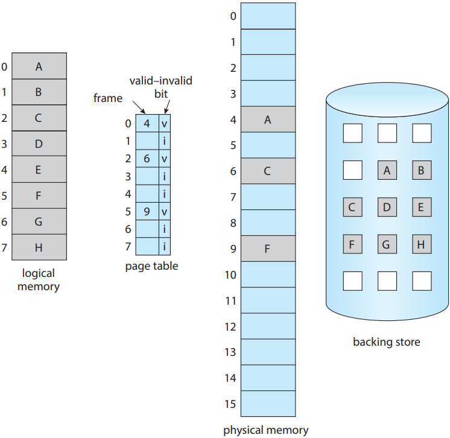

# 메인 메모리와 가상 메모리

## TOC

1. [OS에서의 메모리는 정확히 무엇일까?](#1-os에서의-메모리는-정확히-무엇일까)

---

## 1. OS에서의 메모리는 정확히 무엇일까?

> 사실은 성능을 향상시키기 위해서는 메인 메모리에 여러 프로세스가 올라가 있어야 한다. 즉, 여러 프로세스가 메모리를 공유해야 성능이 올라간다.

**메인 메모리 :**

- CPU가 직접 접근할 수 있는 메모리
- 프로그램이 실행될 때 프로그램이 복사되어 메모리에 적재 -> 프로세스가 된다.
- CPU는 PC가 지시하는 대로 연산을 수행한 후 메인 메모리에 데이터를 저장하거나 필요한 데이터를 요구한다.

    

---

**기본적인 메모리 구성 :**

> 기본적으로 물리 메모리 구현 방법에 대한 개요를 다룬다. 우선적으로 고려해야하는 항목은 다음과 같다.

- `각 프로세스에는 별도의 메모리 공간이 존재`
  - 개별적인 메모리 공간을 분리하기 위해, 특정 프로세스만 접근할 수 있는 합법적인(legal) 메모리 주소 영역을 설정, 프로세스가 합법적인 영역만을 접근하도록 하는 기능이 필요
  - `기본 레지스터` : 가장 작은 합벅적인 물리 메모리 주소
  - `상한 레지스터` : 주어진 영역의 크기

    

> 만약 기준 레지스터값이 300040 이고, 상한이 120900이라면, 기준 ~ 상한의 범위의 주소를 프로세스가 접근할 수 있도록 한다.

---

**메모리 공간의 보호 :**

    

- 기준과 상한 레지스터 하드웨어를 통해서 유저 프로그램이 운영체제나 다른 유저의 코드나 데이터 구조를 수정하는 것을 방지한다.
- 기준 ~ 상한 내부의 범위의 address 만 통과 가능하다.

---

**주소의 할당(Addressing Binding) :**

- 프로그램이 실행되려면, 메모리로 적재한 뒤 `프로세스 컨택스트` 내에 배치해야 함

  - > 프로그램 실행 -> 메모리 적재 -> 프로세스

- 유저 프로그램은 실행되기 전 여러 단계를 거친다.
- 주소는 이 단계에서 여러 다른 방식으로 표시될 수 있음

  - 원시 프로그램에서의 주소는 일반적으로 기호(symbolic)형태로 표현
  - 컴파일러는 이런 기호 주소를 재배치 가능한 주소에 바인딩
    - `예를들어, 여기 모듈 제일 처음에서 15번 뒤 주소로 가주세요.`
  - Linker나 Loader는 재배치 가능한 주소를 절대 주소로 바인딩

> 사용하는 메모리 관리 기법이 뭐냐에 따라서, 프로세스는 실행하는 동안 디스크와 메인 메모리 사이를 왕복 할 수 있다. 대부분 시스템은 유저 프로세스가 메모리에 어떤 부분으로든지 적재될 수 있도록 지원한다. 예를 들어 0000부터 주소가 시작된다고 해도, 가장 첫 프로그램이 0000 부터 시작될 필요는 없다.

---

**유저 프로그램의 단계별 처리 과정 :**

  

      
  

---

**주소 할당의 구분 :**

- 메모리 주소 공간에서 명령어와 데이터의 바인딩은 그 바인딩이 이루어지는 시점에 따라 구분된다.

  - `컴파일 시간 바인딩` : 컴파일 시간에 프로세스가 메모리에 상주할 위치를 미리 알 수 있다면 컴파일러는 절대코드를 생성할 수 있다. 예를들어, 사용자 프로세스가 어떤 특정 번지로부터 시작한다는 것을 미리 알 수 있다면, 컴파일러는 일단 번역해야하는 코드를 그 위치부터 시작한다. 근데 이 위치가 변경이 되어야하는 경우가 있으면 코드가 다시 컴파일해야하는 이슈가 있을 수 있다.

  - `적재 시간 바인딩` : 프로세스가 메모리 어디에 상주할지 컴파일 시간에 알 수 없는 경우 컴파일러는 재배치 가능한 코드를 생성해야 한다. 이 경우에는 심볼, 진짜 메모리 번지 수와의 바인딩이 실제 적재 시간에 이루어진다.

  - `실행 시간 바인딩` : 프로세스가 실행 중에 한 메모리 세그먼트에서 다른 메모리 세그먼트로 이동할 수 있는 경우 바인딩은 실행 시간까지 연기되어야 한다.

---

**논리, 물리 주소 공간 :**

- 컴파일 시간 바인딩은 논리주소와 물리주소가 일치한다.
- 적재 시간 바인딩 기법, 실행 시간 바인딩은 논리주소와 물리주소가 같지 않다.

  - `논리 주소` : CPU에서 생성한 주소(가상 주소)
  - `물리 주소` : 메모리 장치가 보는 주소

- 가상 주소에서 실제 주소로의 실행 시간 맵핑은 MMU(메모리 관리 장치, Memory Management Unit)라고 하는 하드웨어 장치에 의해 수행

  - 주소가 메모리로 전송될 때, 유저 프로세스에 의해 생성된 모든 주소에 재배치 레지스터(기본 레지스터)의 값이 추가된다.
  - 유저 프로그램은 실제 물리적 주소에 절대 접근할 수 없다.

---

**MMU와 동적 재배치 :**

- MMU(Memory management unit)
- 재배치 레지스터를 이용한 동적 재배치

  

      
  

## 2. 연속 메모리 할당과 단편화

**메모리 보호 :**

- 메모리는 일반적으로 `상주 운영체제용` / `유저 프로세스용`으로 구분
- 일반적으로 여러 유저 프로세스가 메모리에 적재되어 있는 것이 바람직

  - 메모리에 가져오기를 입력 큐에서 기다리고 있는 프로세스에 사용 가능한 메모리를 할당하는 방법 고려 필요

- `메모리 보호` :
  - 재배치 레지스터 : 가장 작은 물리 주소의 값을 저장
  - 상한 레지스터 : 논리 주소의 범위값 저장
  - 각 논리 주소는 상한 레지스터에 의해 지정된 범위 내에 존재해야 한다.
  - MMU는 동적으로 논리 주소에 재배치 레지스터 값을 더하여 주소를 변환한다.

---

**재배치와 상한 레지스터를 지원하는 하드웨어 :**

 

      
  

---

**메모리 할당 - 다중 파티션 방식 :**

- 다중 파티션 방식
  - 메모리를 고정된 크기의 여러 파티션으로 나눈다.
  - 각 파티션은 정확히 하나의 프로세스를 포함할 수 있다.
  - 멀티프로그래밍의 정도는 파티션 수에 의해 결정된다.
  - 파티션이 비어 있으면 입력 큐에서 프로세스가 선택되어 비어있는 파티션에 로드된다.
  - 프로세스가 종료되면 파티션을 다른 프로세스에서 사용할 수 있게 된다.

---

**메모리 할당 - 가변 분할 :**

- 가변 분할 기법에서 OS는 사용 가능한 메모리 부분과 사용 중인 메모리 부분을 나타내는 테이블을 유지한다.

- 모든 메모리는 유저 프로세스에 사용 가능하며, 사용 가능한 메모리의 큰 블록을 hole이라고 지칭한다.

 

      
  

---

**동적 메모리 할당 문제 : Free hole들의 리스트로부터 크기가 n인 요청을 어떻게 만족시켜 줄 것인가?**

> 시간이나 메모리 이용 효율 고려가 필요하다.

- `최초 적합` :

  - 첫 번째 사용 가능한 가용 공간 선택
  - 집합의 시작에서부터 검색하거나, 지난번 검색이 끝났던 곳에서 시작
  - 충분히 큰 가용 공간을 찾았을 때 검색 종료

- `최적 적합` :

  - 사용 가능한 공간들 중에서 가장 작은 공간 선택
  - 아주 작은 가용 공간을 만들어 낸다.
  - 리스트가 크기 순으로 되어 있지 않다면 전체 리스트를 검색해야 한다.

- `최악 적합` :
  - 가장 큰 가용 공간 선택
  - 할당 이후 남는 자유공간이 충분히 커서 다른 프로세스들이 사용해야 한다.
  - 자유공간이 크기 순으로 정렬되어 있지 않으면 전 리스트 다 검색해야한다.

---

**단편화(Fragmentation) 개념 :**

> 공간 중에 일부가 사용되지 못하는 부분

- 최초 적합, 최적 적합 모두 `외부단편화`가 발생한다.
- `외부단편화` : 요청을 충족하기에 충분한 총 메모리 공간이 있지만, 사용 가능한 공간이 연속적이지 않은 경우

  - 스토리지가 여러 개의 hole들로 분할된다.

  - 총 메모리 저장 용량과 평균 프로세스 크기에 따라 외부 단편화는 사소하거나 / 중요한 문제일 수 있다.
  - 일반적인 해소 방법 : 물리 메모리를 고정 크기 블록으로 나누고 블록 크기에 따라 정수배로 메모리 할당

- `내부단편화` : 프로세스에 할당된 메모리가 요청된 메모리보다 약간 클 수 있다. 이들 크기 사이의 남는 부분

---

**단편화 - 압축 :**

- 외부 단편화 문제에 대한 하나의 솔루션
- 사용 가능한 모든 메모리를 하나의 큰 블록으로 만들도록 메모리를 모으는 것
- 재배치가 동적이고 실행시간에 수행되는 경우만 가능하다.
- 압축이 가능할 경우 비용 결정이 필요
  - 모든 프로세스를 메모리의 한쪽 끝으로 이동

## 3. 페이징

**페이징 :**

- 프로세스의 물리 주소 공간이 연속적이지 않도록 하는 메모리 관리 체계다.
- 외부 단편화를 방지한다.

- `기본방법` :

 

      
  

- 물리 메모리를 프레임이라고 하는 고정된 크기의 블록으로 나눈다.
- 논리 메모리를 페이지라고 하는 동일한 크기의 블록으로 나눈다.
- CPU에 의해 생성된 모든 주소는 페이지 번호(p), 페이지 오프셋(d) 두 부분으로 나뉜다.
  - 페이지 번호 : 페이지 테이블에 대한 인덱스로 사용
  - 페이지 테이블 : 물리 메모리에 있는 각 프레임의 기본주소를 포함. 프레임의 기본 주소가 페이지 오프셋과 결합되어 물리 메모리 주소를 정의한다. (논리 메모리와 물리 메모리를 매핑해주는 용도)

---

**페이징 하드웨어 :**

 

      
  

- CPU가 논리주소를 호출한다.
- 논리주소는 페이지 번호, 페이지 오프셋을 가지고 있다.
- 페이지 테이블에 가서 프레임의 주소를 찾고, 프레임의 오프셋을 가지고 간다.
- 그 다음 물리메모리에 가서, 찾은 프레임에 가서 오프셋만큼 이동한 다음 이동된 주소값을 요청할 수 있게된다.

---

**논리 및 물리 메모리로 이루어진 페이징 모델 :**

 

      
  

---

**페이지 크기 :**

> 프레임 크기처럼 페이지 크기도 하드웨어에 의해 정해진다.

- 페이지 크기는 일반적으로 2의 거듭제곱. 페이지당 4KB ~ 1GB
  - 2의 거듭제곱 구조일 때, 논리주소를 페이지 번호, 오프셋으로 변환하는게 편리함
- 외부 단편화 방지
- 논리 주소 공간 사이즈가 2^m, 페이지 사이즈가 2^n 바이트라고 할 때, 논리 주소의 상위 m-n비트는 페이지 번호를 지정, 하위 n비트는 페이지 오프셋 지정
- p는 페이지 테이블의 인덱스, d는 페이지 내의 오프셋으로 사용한다.

 

      
  

---

**바이트 페이지를 가진 32바이트 메모리 페이징 예시 :**

- 논리 주소에서, n = 2, m = 4일때, 논리주소 0,3,4,13은 어디에 위치하게 될까?

 

      
  

- 논리 주소 0 :
  - page 0, offset 0. 물리주소 20[=(5x4)+0]
- 논리 주소 3 :
  - page 0, offset 3. 물리주소 23[=(5x4)+3]
- 논리 주소 4 :
  - page 1, offset 0. 물리주소 24[=(6x4)+0]
- 논리 주소 13 :
  - page 3, offset 1. 물리주소 9[=(2x4)+1]

---

**페이징 시 내부단편화 :**

- 외부 단편화는 없으나, 내부 단편화가 존재할 수 있다.

- 프로세스가 페이지 경계와 일치하지 않는 크기의 메모리를 요구한다면, 마지막 페이지 프레임은 전부 할당되지 않는다.

- 평균적으로는 프로세스 당 반 페이지 정도의 내부 단편화를 예상한다.
  - 페이지 크기가 작을수록 좋은가?
  - 페이지 테이블의 크기가 반비례 관계로 커지게 된다.
  - 디스크 입장에서는? 페이지 크기가 클수록 효율적이다.

---

**하드웨어 지원 - TLB :**

> 각 OS들은 페이지 테이블들을 저장하기 위해 고유의 자원, 고유의 방법을 가지고 있다.

- 첫번째로는 페이지 테이블은 고속 논리 회로로 설계되어 페이지 주소 변환을 매우 효율적으로 만든다. (레지스터 사용은 페이지 테이블이 작을 경우 적합)

- 두번째 아이디어로는, 대부분의 컴퓨터는 페이지 테이블을 메인 메모리에 저장. `페이지 테이블 기준 레지스터(PTBR, Page-Table Base Register)`로 하여금 페이지 테이블을 가리킴

  - 메모리 접근 시간 문제 발생

- `TLB(Translation Look-aside Buffers) 캐시 `사용
  - Key(혹은 tag), Value로 구성
  - TLB는 페이지 테이블과 함께 사용된다. 페이지 테이블 항목 중 일부만 포함
  - 페이지 번호를 찾으면 프레임 번호를 즉시 사용. 메모리 액세스에 사용
  - 페이지 번호가 TLB에 없으면 페이지 테이블에 대한 메모리 참조를 새로 생성

---

**TLB가 장착된 페이징 하드웨어 :**

 

      
  

---

**페이징을 할 때 메모리를 어떻게 보호할 것인가?**

> 메모리 보호는 각 프레임과 관련된 보호 비트(1비트)에 의해 수행된다. (일반적으로 페이지 테이블에 포함)

- 페이지 읽기-쓰기 또는 읽기 전용 비트

  - 보호 비트를 검사하여 읽기 전용 페이지에 쓰기를 시도하면 위반을 검출한다.

- 유효-무효 비트

  - `유효`로 설정되면 관련된 페이지가 프로세스의 합법적인 페이지임을 나타낸다.
  - `무효`로 설정되면 그 페이지는 프로세스의 논리 주소 공간에 속하지 않는다는 것을 나타낸다.

---

**페이지 테이블에서의 유효-무효 비트 :**

 

      
  

---

**공유 페이지 :**

- 페이징의 장점은 공통 코드를 공유할 수 있다는 것이다.

      
  

## 4. 가상 메모리

> [가상메모리 기법과 가상 주소 공간의 차이점 보러가기](https://velog.io/@mysprtlty/%EA%B0%80%EC%83%81-%EB%A9%94%EB%AA%A8%EB%A6%AC%EC%99%80-%EA%B0%80%EC%83%81-%EC%A3%BC%EC%86%8C-%EA%B3%B5%EA%B0%84)

**은행의 지급 준비제도 :**

- 시중 은행 등의 금융기관이 지급 준비금으로 불리는 일정량의 현금 또는 그에 준하는 자산을 중앙은행에 예치한 것이다.

- 은행은 실제 가지고 있는 것보다 더 많은 가상의 자산이 있다.

---

**프로그램을 일부만 메모리에 적재한다면? :**

- 지금까지 배운 메모리 관리는 "실행중인 코드는 반드시 물리 메모리에 있어야 한다."
- 오류코드나 필요 이상으로 많은 공간을 점유하는 자료구조, 옵션이나 자주 사용되지 않는 기능들도 항상 메모리에 적재되어있어야 하는가?
- 만일 프로그램을 일부분만 메모리에 올려놓고 실행할 수 있다면
  - 프로그램이 물리 메모리 크기에 더 이상 제약 받지 않게 됨
  - 더 많은 프로그램을 동시에 수행할 수 있다.
  - 프로그램을 메모리에 올리고 스왑하는데 필요한 입출력 횟수가 줄어들기 때문에 프로그램들이 보다 빨리 실행된다.

---

**가상 메모리 :**

- 실제의 물리 메모리 개념과 사용자의 논리 메모리 개념을 분리
- 작은 메모리를 가지고도 얼마든지 큰 가상 주소 공간을 프로그래머에게 제공할 수 있다.

    

- 한 프로세스의 가상 주소 공간은 그 프로세스가 메모리에 저장되는 논리적인 모습(View)이다.
  - 동적 메모리 할당에 사용되므로 힙이 메모리에서 위쪽으로 증가하도록 허용
  - 연속적인 함수 호출을 위해 스택이 메모리에서 아래쪽으로 커지도록 허용

---

**가상 메모리의 이점 :**

    

- 가상 메모리를 사용하면 페이지 공유를 통해 둘 이상의 프로세스에서 파일과 메모리를 공유할 수 있다.
  - 라이브러리가 존재하는 물리 메모리 페이지들은 모든 프로세스에게 공유되고 있다.
  - 한 프로세스가 다른 프로세스와 공유할 수 있는 메모리 영역을 생성할 수 있다.

---

**요구페이징 개요 :**

- 실행 가능한 프로그램이 보조 저장소에서 메모리에 적재되는 방법을 생각해보자
  - 프로그램 실행 시 전체 프로그램을 물리 메모리에 적재
  - 필요할 때만 페이지 적재 (요구 페이징)
    - 페이징이 필요하다.
    - 요구 페이징 가상 메모리를 사용하면 프로그램 실행 중 요청이 있을 때만 페이지가 로드된다.
    - 액세스 되지 않은 페이지는 물리 메모리에 적재되지 않는다.
    - 스왑 인, 스왑 아웃을 관리하는 페이저

---

**요구페이징 기본 개념 :**

- 메모리에 존재하는 페이지와 디스크에 존재하는 페이지를 구별하기 위해 어떤 형태의 하드웨어 지원이 필요하다.
  - 유효-무효 비트(valid-invalid bit)
    - `vaild`라면 관련 페이지가 메모리에 존재한다.
    - `invalid`라면 페이지가 유효하지 않거나 유효하지만 현재 메모리에 존재하지 않고 보조 저장소에 있다는 의미다.
  - 프로세스가 해당 페이지에 액세스를 시도하지 않는다면, 페이지를 invalid로 표시한다고 해도 아무 효과가 없다.

---

**메인메모리에 페이지들이 존재하지 않을 떄의 페이지 테이블 :**

    

---

**페이지 폴트 :**

> 프로세스가 메모리로 가져오지 않은 페이지에 액세스 하려고 한다면 어떻게 되는가?

- `페이지 폴트(Page fault)` : 무효로 표시된 페이지에 대한 액세스

- 페이지 폴트 처리절차
  - 유효한 메모리 접근인지, 무효한 메모리 접근인지 확인을 위해 프로세스 내부 테이블을 확인
  - 유효하지 않은 경우 프로세스를 종료, 유효하지만 아직 해당 페이지를 가져오지 않은 경우 페이지를 입력
  - 비어있는 프레임 검색
  - 원하는 페이지를 새로 할당된 프레임으로 읽어 들이기 위해 2차 저장작업을 예약
  - 저장소 읽기가 완료되면 프로세스와 함께 유지되는 내부 테이블과 페이지 테이블을 수정해 페이지가 현재 메모리에 있음을 나타낸다.
  - 트랩에 의해 중단된 명령을 재개. 프로세스는 메모리에 있었던 것처럼 페이지 액세스 가능

---

**페이지 폴트 핸들링 절차 :**

  

- 위와 같은 절차를 통해 사용자는 원래 메모리에 올라와있는 페이지처럼 사용할 수 있다.

---

**순수한 요구페이징 :**

- `순수한 요구 페이징` : 필요할 때까지 페이지를 메모리에 적재하지 않는다.

- 일부 프로그램은 각 명령을 실행할 떄마다 여러개의 새 메모리 페이지에 액세스 할 수 있으며(명령에 대한 한 페이지, 데이터에 대한 여러 페이지), 명령 당 여러 페이지 폴트가 발생할 수 있다.

> 프로세스의 경향성을 보면 프로세스는 작은 부분을 일정 시간동안 집중
> 적으로 참조하는 경향이 있기 때문에 요구페이징에 대한 성능에 대해 페이지 폴트가 성능 저하를 시킬 가능성이 있지만 그렇게 놓지 않을 수 있다.

- 요구 하드웨어 자원
  - 페이지 테이블
  - 보조 메모리 - 고속디스크(스왑 장치)
  - 이 메모리는 메인 메모리에 존재하지 않는 페이지를 홀드한다.(스왑공간)

---

**쓰기 시 복사의 개념 :**

- 부모 및 자식 프로세스가 처음에 동일한 페이지를 공유하도록 허용하여 작동
- 프로세스 중 하나가 공유 페이지에 쓰는 경우 공유 페이지의 복사본이 생성된다.

> 예를 들어 자식 프로세스가 페이지 수정을 시도한다면, 운영 체제는 이 페이지의 복사본을 생성하여 자식 프로세스의 주소 공간에 매핑한다. 자식 프로세스는 부모 프로세스에 속한 페이지가 아닌 복사된 페이지를 수정한다.

다음은 프로세스 1이 페이지 C를 수정하기 전 그림이다.

    

프로세스 1이 페이지 C를 수정한 이후에는 새로운 복사본 페이지가 생성된다.

    

## 5. 페이지 교체

**메모리 과잉 할당 문제 :**

- 다중 프로그래밍의 정도를 높일수록 메모리 과할당이 발생할 수 있다.

- `메모리 과할당 발생`

  - 유저 프로세스가 실행되는 동안 페이지 폴트가 발생한다면
  - 운영체제는 원하는 페이지가 보조 저장소에 있는 위치를 결정하지만, 모든 메모리가 사용 중이므로 빈 프레임이 없음을 확인

- 메모리 과도 할당에 대한 옵션들
  - 프로세스 종료
  - 페이지 교체(가장 보편적인 솔루션)

---

**페이지 교체 필요 상황 :**

    

- 프로세스1 에서 페이지 폴트 발생
- 보조 저장소에서 위치 찾음
- 빈 프레임이 없다.
- 또한 프로세스2 에서 G를 로드하고 싶은데 자리가 없다.

> 위와 같은 상황을 과할당이라고 한다. 페이지 교체 필요성이 생긴다.

---

**페이지 교체 기본 :**

    

- 보조 저장소에서 원하는 페이지의 위치를 검색한다.
- 빈 프레임을 찾는다.
  - 빈 프레임이 존재한다면 사용한다.
  - 만약 빈 프레임이 존재하지 않는다면 페이지 교체 알고리즘을 사용하여 희생 프레임을 선택한다.
  - 희생 프레임을 2차 저장소에 기록한다.(필요시), 그에 따라 페이지 및 프레임 테이블을 변경한다.
- 원하는 페이지를 새롭게 비게 된 프레임으로 읽는다. 페이지 및 프레임 테이블 변경
- 페이지 폴트가 발생한 유저 프로세스를 계속 진행한다.

---

**수정 비트(Modify bit or Dirty bit) :**

- 빈 프레임이 없다면 두번의 전송이 필요하다. (page-out, page-in)
- 수정 비트(혹은 더티 비트)를 사용하여 오버헤드를 줄일 수 있다.
- 페이지의 수정 비트는 페이지의 바이트가 기록 될 때마다 하드웨어에 의해 설정되어 페이지가 수정되었음을 나타낸다.
- 이 방식은 페이지가 수정되지 않은 경우 I/O 시간을 절반으로 줄이기 떄문에 페이지 폴트를 처리하는 데 필요한 시간을 크게 줄일 수 있다.

> 페이지가 변경되지 않았다면 page-out 과정을 생략하고 새로운 페이지를 page-in만 하면 된다. 왜냐하면 바뀐게 없기 때문이다.

---

**요구 페이징 시스템 필요 알고리즘 :**

- `프레임 할당 알고리즘`

  - 메모리에 여러 프로세스가 있는 경우 각 프로세스에 할당할 프레임 수 결정이 필요하다.

- `페이지 교체 알고리즘`

  - 페이지 교체가 필요한 경우 교체할 프레임을 선택해야 한다.

- `참조열(reference string)`
  - 메모리 참조열
  - 주소 시퀀스
    - 0100, 0432, 0101, 0612, 0102, 0103, 0104, 0101, 0611, 0102
  - 참조 문자열
    - 1, 4, 1, 6, 1, 6, 1, 6,1

> 참조열들을 통해서 알고리즘을 선정하는데 참고되는지 확인해보자.

---

**프레임 수에 따른 페이지 폴트 그래프 :**

> 프레임 수가 증가함에 따라 페이지 폴트 수는 최소 수준으로 떨어진다.

    

---

**FIFO 페이지 교체 :**

- 가장 간단한 페이지 교체 알고리즘
- 페이지를 교체해야 하는 경우 가장 오래된 페이지가 선택된다.

    

> 위와 같은 경우 총 15번의 페이지 폴트가 발생하게 된다. 비효율이 발생한다.

---

**참조 문자열에서의 FIFO 페이지 교체를 위한 페이지 폴트 곡선 :**

    

- 벨레이디의 모순(Belady's Anomaly)
  - 페이지 교체 알고리즘 중의 하나인 FIFO(First In First Out)에서, 원래 페이지 프레임의 개수를 늘리면 page fault발생이 감소 해야 하나, 오히려 늘어나는 경우가 발생하는데 그것을 `Belady's Anomaly`라 한다.

---

**최적 페이지 교체 :**

- 모든 알고리즘 중 가장 낮은 페이지 폴트율
- 장기간 사용하지 않을 페이지를 교체한다.

    

> 7, 0, 1이 채워진 이후에 2를 넣을 때 7이 빠진 이유는 가장 나중에 사용되기 때문이다. 9번의 페이지 폴트가 발생한다. 단, 최적이라는 것은 뒤까지 어떻게 판단할 것인 지, 어떻게 인지하는지 어렵다.

---

**LRU(Least-Recently-Used) 페이지 교체 :**

- 최적 알고리즘의 근사치
- 가장 오랫동안 사용하지 않은 페이지 교체
- LRU 교체는 해당 페이지가 마지막으로 사용된 각 페이지와 연결한다.

    

> 총 12번의 페이지 폴트가 발생한다. 적어도 FIFO보단 낫다.
