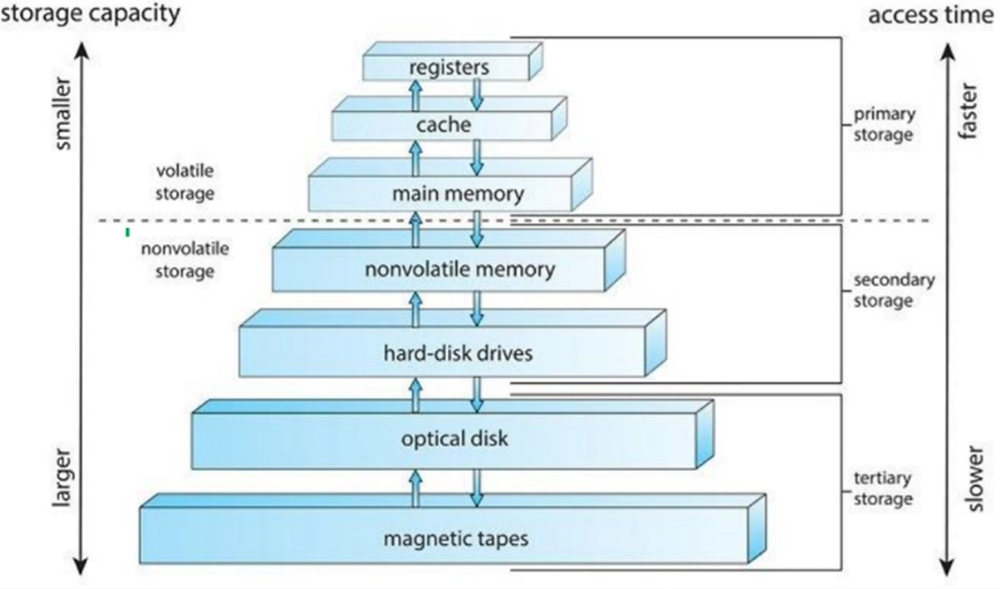
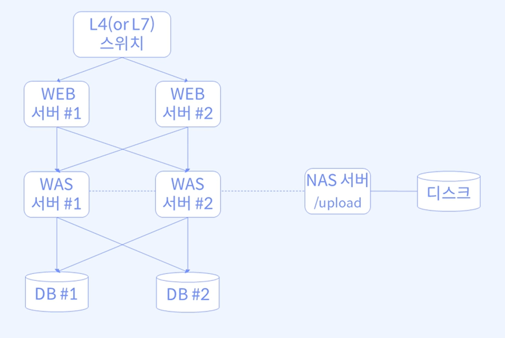
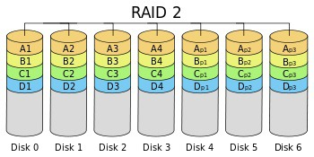
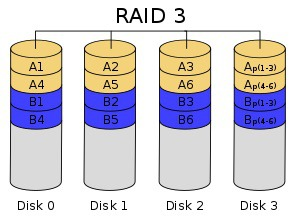
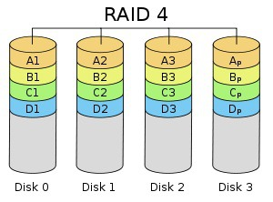

# 대용량 저장장치 구조

## TOC

1. [저장장치 계층](#1-저장장치-계층)
2. [RAID](#2-raid)

---

## 1. 저장장치 계층

> 모든 프로그램과 데이터가 메인메모리에 있다면 이상적이지 않을까?

- 영구적으로 저장하기에는 용량이 너무 작다.
- 메인메모리는 휘발성 저장장치다.

- 저장장치 시스템은 계층 구조로 이루어진다.
  - 한정된 비용에서 속도, 용량, 휘발성에 따라 트레이드 오프가 존재해서 여러 계층으로 정립될 필요성이 있었다.

    

---

**종류 :**

- 하드 디스크

  - 자기적으로 기록하여 저장할 수 있는 플래터, 암 등으로 이루어진 디스크
  - 디스크는 대량의 보조 저장장치를 제공한다.

- SSD(Solid State Disk)

  - 하드 디스크처럼 사용되는 비휘발성 메모리
  - 기계적 이동 부품이 없어 신뢰도가 높다.
  - 탐색, 지연이 없어 속도가 빠르고 전력소모가 낮다.

- 자기테이프
  - 초기의 보조 저장장치 매체. 현재는 백업용, 장기저장용으로 사용

---

**스토리지 - 구성 방식으로 구분 :**

- DAS(Direct Attached Storage)

  - 서버에 직접 연결하는 방식

- SAN(Storage Area Network)

  - SAN 스위치를 구성한 뒤 서버와 스토리지를 연결
  - 성능과 확장성이 높다.

- NAS(Network Attached Storage)
  - 네트워크를 통해서 서버와 스토리지를 연결

---

**DAS(Direct Attached Storage) :**

- 서버가 채널(SCSI 또는 광섬유)을 통해 저장장치에 직접 연결하는 방식이다.
- 확장이 쉽고 속도가 빠르다.
- 연결 수에 한계가 있다.
- 문제 발생시 순단 가능성이 있다.
- 각 서버는 직접 파일 시스템을 관리한다.

---

**NAS(Network Attached Storage) :**

- 서버와 저장장치가 이더넷 등의 LAN 방식의 네트워크에 연결된 방식이다.
- LAN은 TCP/IP 프로토콜 기반, 저장장치는 SCSI 사용
  - 통신을 위해 중계역할의 파일서버가 필요하다.
- 확장성, 유연성이 뛰어나다.
- 경제적이고 설치가 쉽다.
- 커넥션 증가 시 성능문제 발생 가능성이 있다.

---

**미들웨어 구조로 보는 NAS(Network Attached storage) 활용 예시 :**

    

---

**SAN(Storage Area Network) :**

- 서버와 저장장치를 광섬유 스위치로 연결한 고속 데이터 네트워크
- SAN 스위치를 구성한 뒤 서버와 스토리지를 연결한다.
- 확장성, 유연성, 가용성이 우수하다.

---

**DAS, NAS, SAN 비교 :**

|                 | DAS            | NAS                                | SAN                                       |
| --------------- | -------------- | ---------------------------------- | ----------------------------------------- |
| 구성요소        | 서버, 저장장치 | 서버, 전용파일서버, 저장장치       | 서버, FC 스위치, 저장장치                 |
| 접속장치        | X              | 이더넷 스위치로 접속               | 광섬유 스위치로 접속                      |
| 규모            | 소규모         | 중규모                             | 대규모                                    |
| 파일시스템 공유 | 불가능         | 가능                               | 불가능                                    |
| 주요 사용처     |                | 파일 공유, 동시 접속이 필요한 경우 | DB, 가상화 등 대규모의 처리가 필요할 경우 |
| 비용            |                | (상대적으로) 낮음                  | (상대적으로) 높음                         |

## 2. RAID

**RAID(Redundant Array of inexpensive Disks) 개념 :**

- 필요성의 대두

  - 반드시 백업이 필요한 경우
  - 스토리지에 물리적인 이상이 발생하더라도 사용자가 체감할 수 없어야 한다.
  - 용량 증설 검토 시 데이터의 손실 없이 증설 필요
  - 여러 개의 디스크를 배치하여 속도, 안정성, 효율성, 가용성을 높인다.

- 크게 미러링(mirroring), 스트라이핑(striping)으로 나눠진다.

---

**RAID 0(Stripe) :**

    

- 두 개 이상의 디스크에 데이터를 무작위로 write한다.
- 장점 : 데이터 사용시 I/O를 디스크 개수만큼 분할하여 쓰기 때문에 I/O 속도가 향상된다.
- 단점 : 디스크 중 하나의 디스크라도 장애가 발생하면 복구가 어렵다.

---

**RAID 1(Mirror) :**

    

- 디스크에 동일한 데이터를 중복 기록한다. 적어도 동일한 디스크 두 개가 필요하다.
- 장점 : 디스크 두 개가 한번에 오류가 발생하지 않는 이상 가용성이 높고 복구가 쉽다.
- 단점 : 사용할 수 있는 디스크가 실제 디스크의 절반이다.

---

**RAID 2(Stripe) :**

    

- 에러 체크, 수정을 위한 해밍코드를 사용한다. ECC(Error Corrention Code)를 별도의 드라이브에 저장한다.
- 단점 : ECC가 저장된 드라이브 손상의 경우 복구가 어렵다. (현재는 거의 사용되지 않음. deprecated)

---

**RAID 3 / RAID 4 (Stripe) :**

    
    

- 에러 체크 및 수정을 위해 패리티 정보를 별도의 디스크에 저장
- RAID 3은 데이터를 바이트 단위로 나누어 분산, RAID4는 블록단위로 나눈다.
- 장점 : 성능 보완. 디스크 용량을 온전히 사용할 수 있다.
- 단점 : 별도의 패리티 디스크의 손상시 리스크가 존재한다.

---

**RAID 5(Stripe) :**

    

- 패리티 정보 자체를 stripe로 구성된 디스크 내에서 처리하게 만든다.
- 장점 : 하나의 디스크가 손상되더라도 남은 디스크들로 데이터 복구가 가능하다.

---

**RAID 6(Stripe) :**

    

- 기본적인 개념은 RAID5와 동일하다. 2차 패리티 정보를 넣어 2개의 디스크에 문제가 생겨도 복구가 가능하다.

- 장점 : 안정성이 굉장히 높다.
- 단점 : 약간의 데이터 공간 사용이 추가적으로 발생한다.

> DR을 고민하는 엔지니어가 되자.
